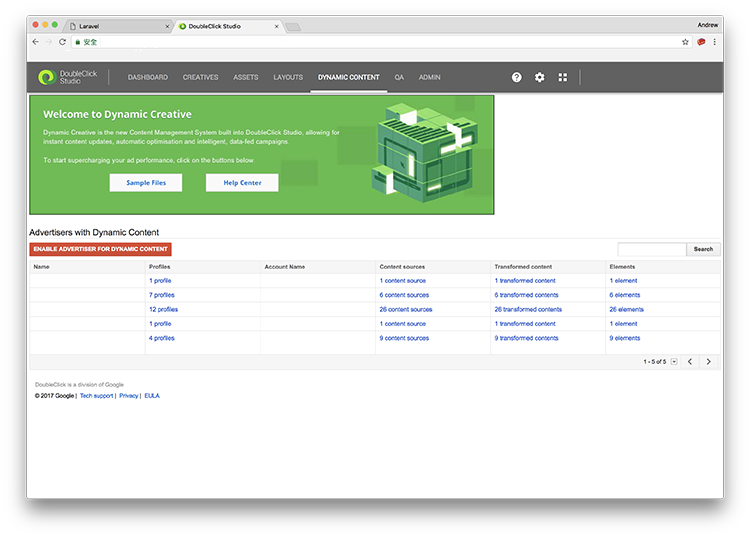
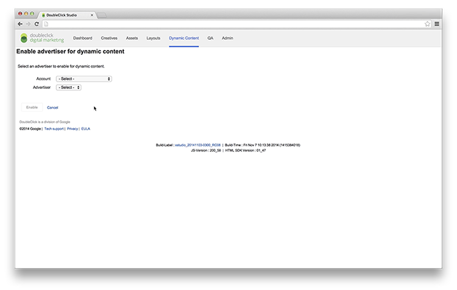
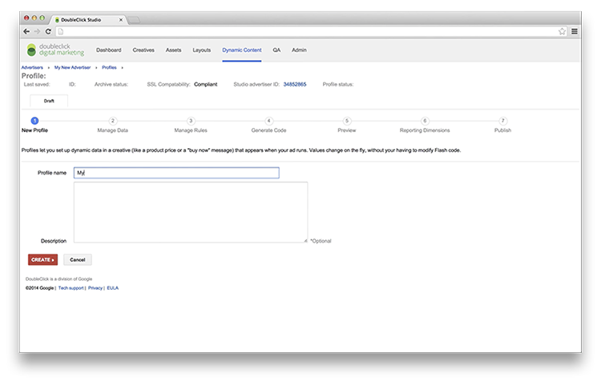
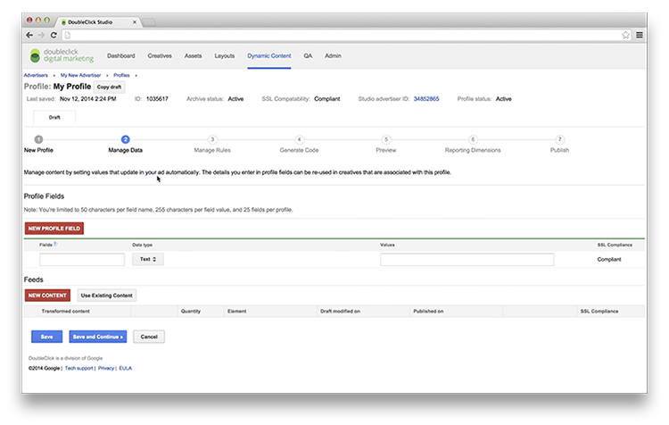
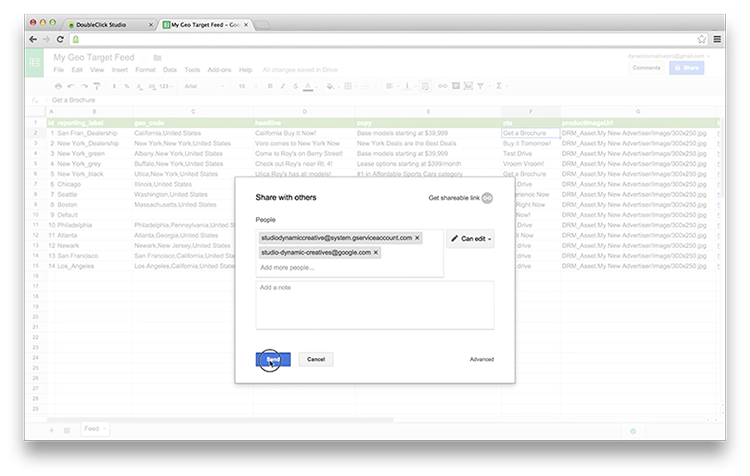
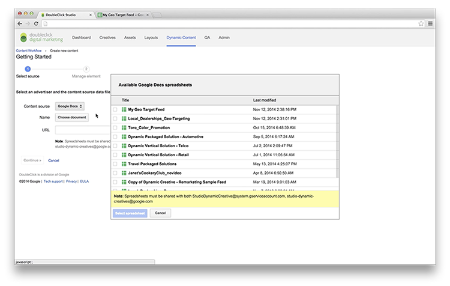
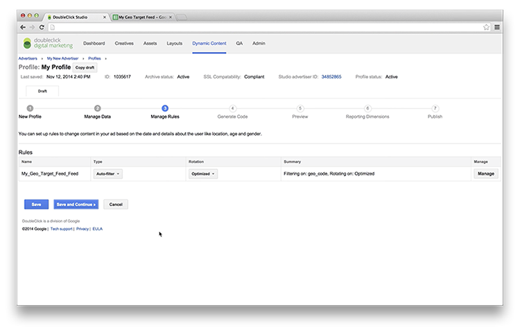
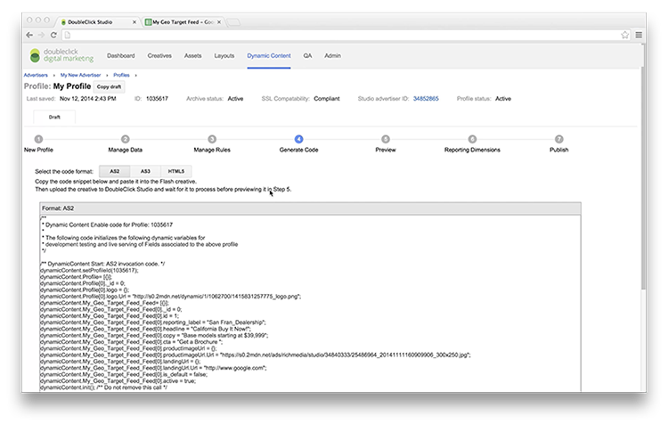
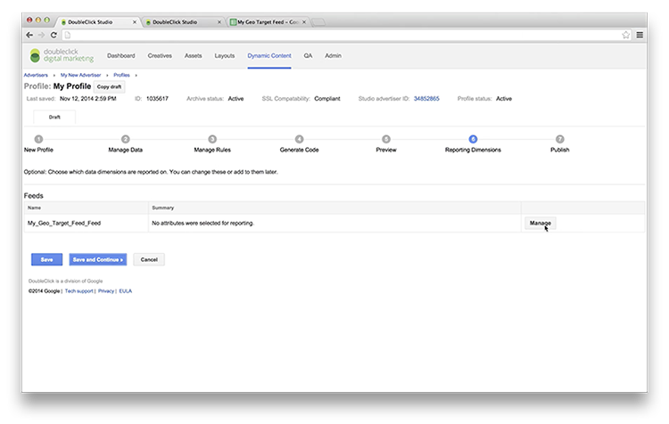
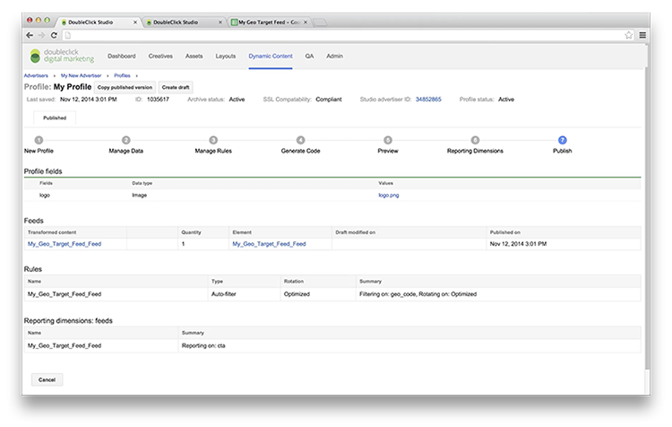

DoubleClick Campaign Manager is an ad management system for advertisers. It provides different tools for advertisers to manage their creatives and run ad campaigns.

In this tutorial series, we will create an ad with dynamic targeting key filtering in DoubleClick Campaign Manager and DoubleClick Studio step by step.

Dynamic targeting keys are unique labels that can be assigned to ads, creatives and placements. By using these keys, it saves time to manage ads with dynamic feeds, and avoid human errors occurs. It is very useful when you need to manage different sets of dynamic ads in one campaign.

> **Update:** DoubleClick is now rebranded as Google Marketing Platform. DoubleClick Campaign Manager and DoubleClick Studio are under one product called Display & Video 360 now. See [this post](https://support.google.com/displayvideo/answer/9015629) and [this post](https://www.blog.google/technology/ads/new-advertising-brands/) for more details.

## 1. Create a dynamic feed

A dynamic feed list usually contains different headlines, URLs and contents that can be served in the creatives. Follow [this guide](https://support.google.com/richmedia/answer/3399836) for creating the dynamic feed for the advertiser, and the sample of dynamic feed list could be found [here](https://docs.google.com/spreadsheets/d/15fz1Yi4bfxJ1k-b7yTxBsDWSS4nVppNCEhxHpANtGNI/edit#gid=0).

The contents of the feed list will be served for the creatives in the ad placement with suitable targeting keys. To link up the keys between the ad placement and advertiser profile, we will have a column in the spreadsheet called “Keywords”. Enter the value for each row of content is targeted, and the value should match that we will add to the ad placement later. To target multiple keys, you may enter comma-separated values.

## 2. Upload a dynamic feed to advertiser profile

If you have your dynamic feed ready, it is time to upload it to the advertiser profile!

Open DoubleClick Studio, and click Dynamic Content on the navigation bar.

Click Enable Advertiser for dynamic content, and choose your account and related advertiser in following next page.

After you enabled it, you can create a new advertiser profile. To begin, click **New profile** button and fill in the required field — Profile name.

After that, you can upload the feeds you created in Feeds of Manage Data section. Click **New Content** button, and transform your feed into this profile.

Before you transform the file, please make sure that you shared the spreadsheet to two email accounts: studiodynamiccreative@system.gserviceaccount.com and studio-dynamic-creatives@google.com.

You can select the content source from Google Docs and upload the dynamic feed list just created, then click **Start Import** button.

If imported data looks correct in the preview section, before you click the **Continue** button, make sure you selected suitable data fields for ID and Reporting label, and correct data types in different columns.

After those data are successfully transformed, you should able to see the transformed content in Feed column. Click **Save and Continue**. After that, you can manage rules for different feeds imported. Usually, we can keep the default settings — **Auto-filter** type and **Optimised** Rotation, unless you have other preference for the ad rotation.

After that, you are able to see the code generated for the ads. See next section for the usage of this code later.

Then you can select the reporting dimensions for this profile, according to the columns imported.

Great! Then publish the advertiser profile to active, so that you can start using them in the creatives.

**Congratulations! **It is able to be served with dynamic creatives by your advertiser profile just set. [Check out our next post for creating ads in Google Web Designer.](../doubleclick-campaign-manager-2)

### Series: Creating ads with dynamic targeting key filtering in DoubleClick Campaign Manager

* **Part 1: Import dynamic feed to advertiser profile in DoubleClick Studio**
* [Part 2: Create dynamic creatives in Google Web Designer with DoubleClick Studio](../doubleclick-campaign-manager-2)
* [Part 3: Manage ads with dynamic targeting key in DoubleClick Campaign Manager](../doubleclick-campaign-manager-3)
