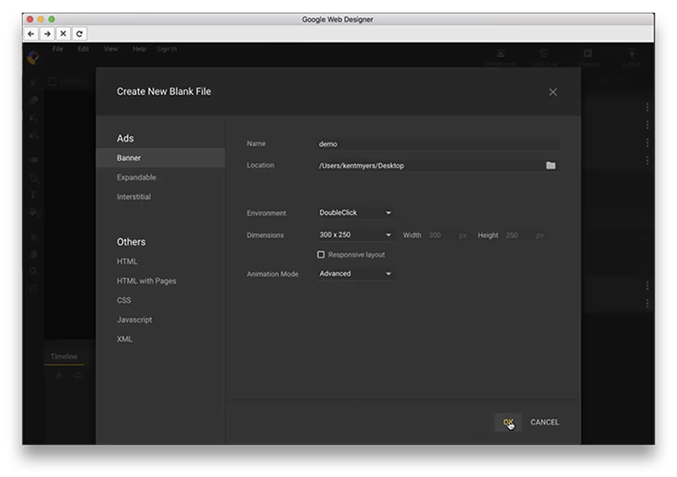
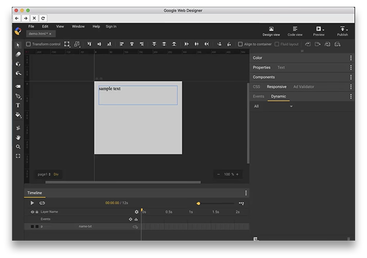
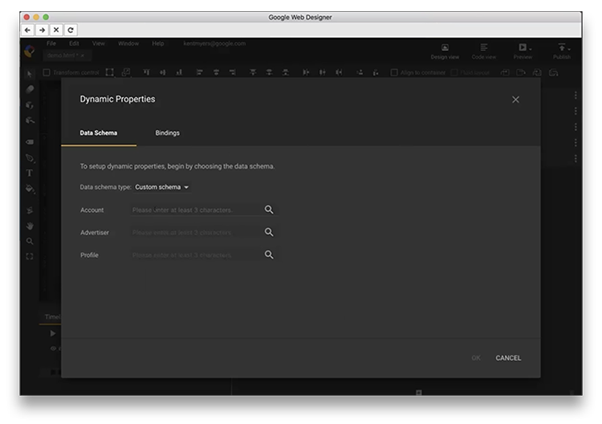
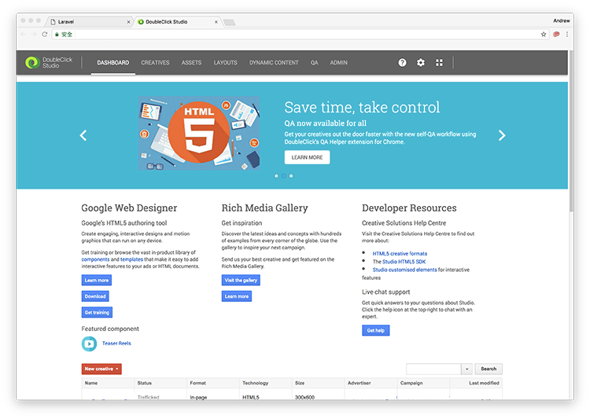
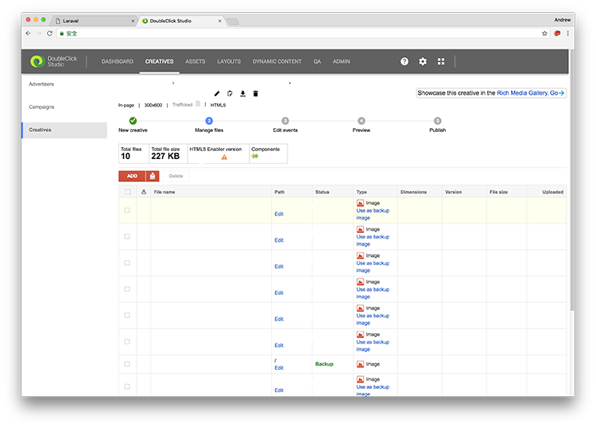

We will create a creative with associate advertiser profile created in the previous tutorial.

## 3. Upload creatives with associate advertiser profile

Those code generated in the previous section should be placed in your creative so that those dynamic contents can be shown. Or you can use Google Web Designer to design creatives with advertiser profile associated.

When you create a new blank file in Google Web Designer, choose **DoubleClick** as your environment.

You can start your creation after created a new blank file. After that, to import the dynamic content from the advertiser profile, Click **Dynamic** tab next to **Events**, and click the **Add** icon at the bottom.

For the first time, you are required to log in to your Google account. After that, you can choose the advertiser and profile from your account. You will see dynamic contents source and you may need to link them with your page elements.

After that, just publish your creatives by clicking the **Publish** icon at top right corner. Switch back to DoubleClick Studio, and click the **Creatives** tab at the navigation bar.

You should be able to see your creatives uploaded in Creatives section. You can preview your banner uploaded here, and send it to DoubleClick QA for approval.

[In the next tutorial, we will talk about how to manage dynamic ads in DoubleClick Campaign Manager.](../doubleclick-campaign-manager-3)

### Series: Creating ads with dynamic targeting key filtering in DoubleClick Campaign Manager

* [Part 1: Import dynamic feed to advertiser profile in DoubleClick Studio](../doubleclick-campaign-manager-1)
* **Part 2: Create dynamic creatives in Google Web Designer with DoubleClick Studio**
* [Part 3: Manage ads with dynamic targeting key in DoubleClick Campaign Manager](../doubleclick-campaign-manager-3)
