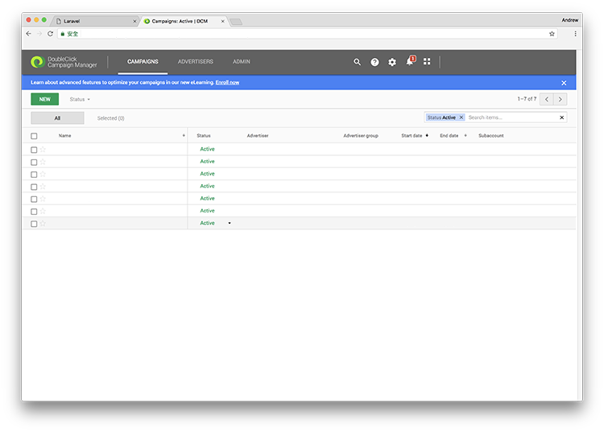
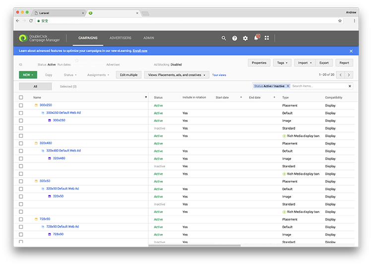
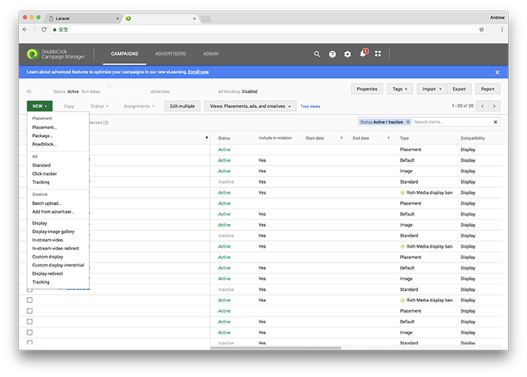
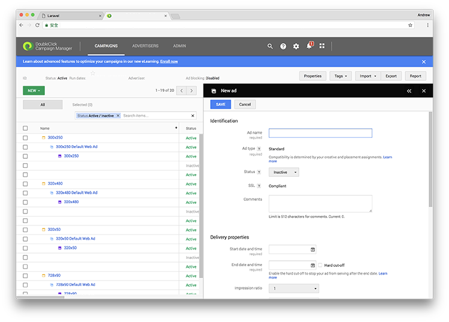
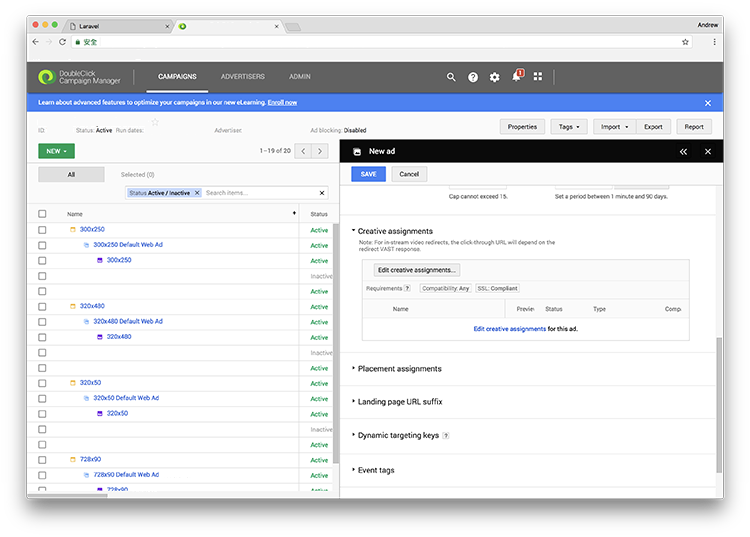
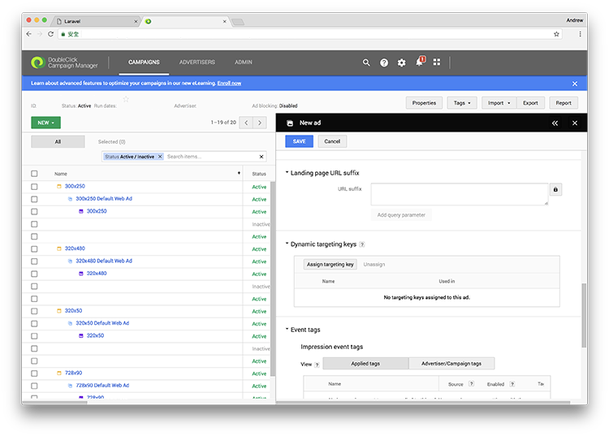
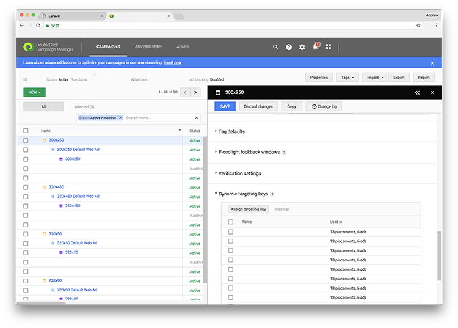

We will manage our ads with dynamic targeting key in DoubleClick Campaign Manager.

## 4. Create a new campaign

You can manage your ads and campaigns in DoubleClick Campaign Manager. Click **Campaigns** section, and choose a campaign that you would like to continue. If you have no campaign created before, you can click **New** button to create a new campaign.

You can see all ad placements and related ads in this campaign are shown here.

Click **New** button, and click **Ad Standard** to add a new ad. If you have no ad placement created before, a new ad placement will be automatically created for your new ad.

You can see a new window at the right bottom corner. You need to fill in a name for this ad for identification. Also, you can set different properties for this ad, like the advertising period and impression ratio (comparing to other ads in the same ad placement).

You need to assign at least one creative to this ad. Click **Edit creative assignments** and choose the dynamic creative you uploaded to DoubleClick Studio in the previous tutorial.

After that, you need to set up dynamic targeting keys for this ad or ad placement. Click **Assign targeting key** and add your targeting key you would like to relate to this ad.

After that, you can set up the remaining settings like event tags and save it by clicking **Save** button!

You may repeat those steps for different ads and ad placements. If it is good to go, you can click **Tags** to generate HTML tags code for publishers to place your ads on their website or system.

### Series: Creating ads with dynamic targeting key filtering in DoubleClick Campaign Manager

* [Part 1: Import dynamic feed to advertiser profile in DoubleClick Studio](../doubleclick-campaign-manager-1)
* [Part 2: Create dynamic creatives in Google Web Designer with DoubleClick Studio](../doubleclick-campaign-manager-2)
* **Part 3: Manage ads with dynamic targeting key in DoubleClick Campaign Manager**
