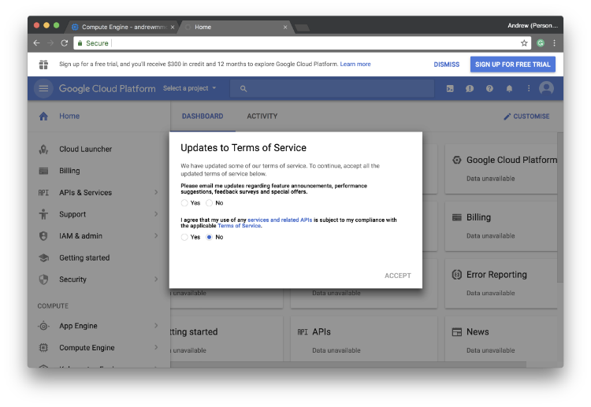
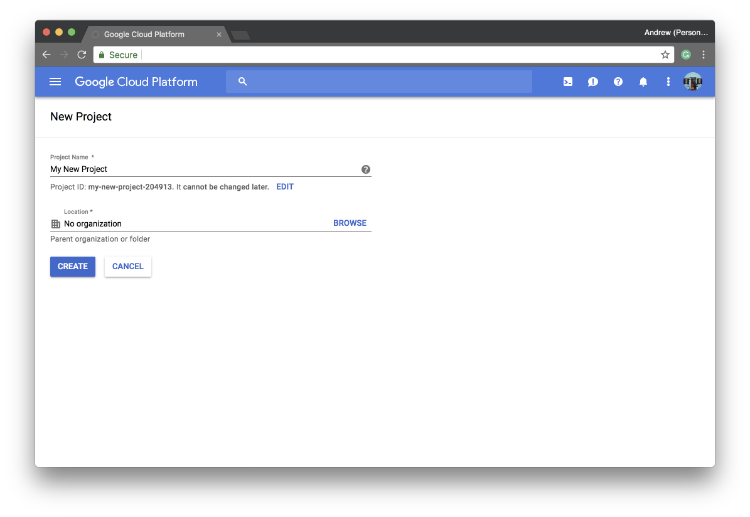
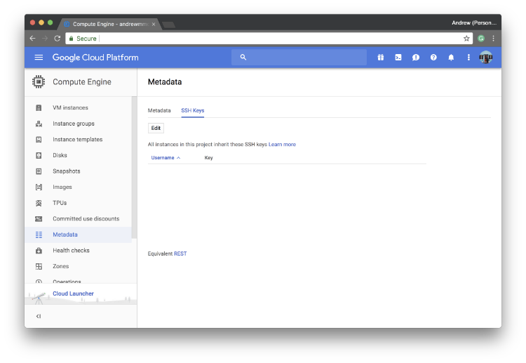
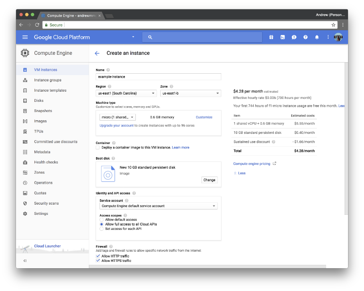
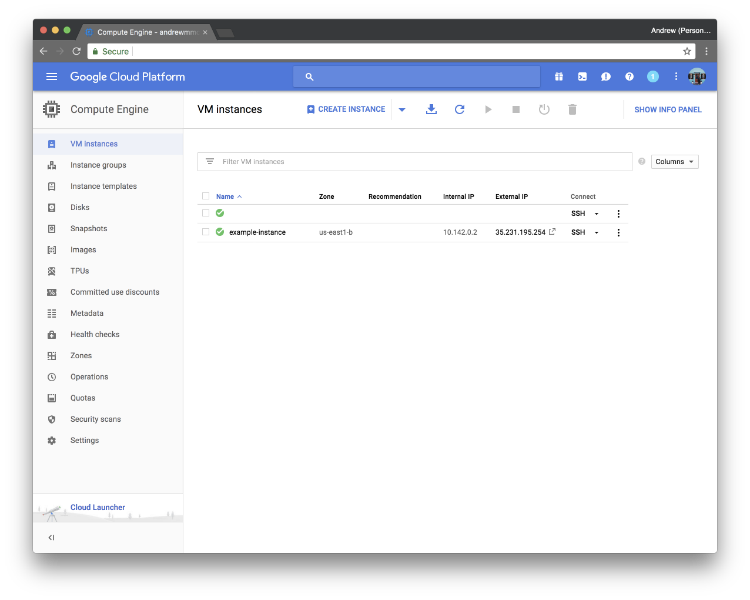
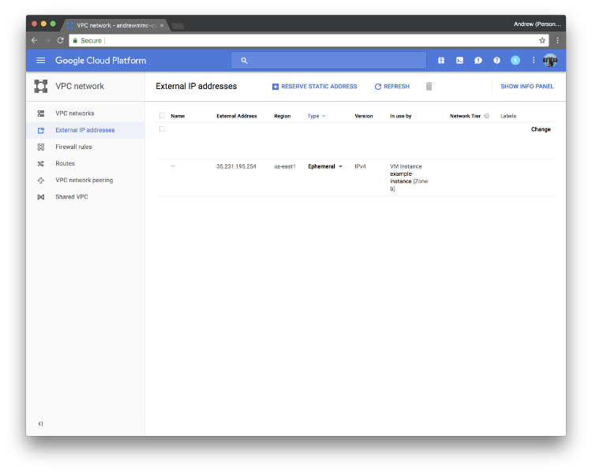
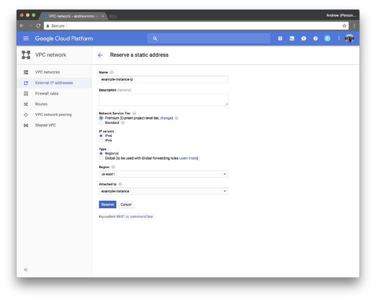

Vesta Control Panel is a free and open source control panel with LEMP stack. 
It provides different functionalities including website, email, database, DNS and more.

In this series, we will set up a full functionality website server with the control panel on Google Cloud Compute Engine. By the end of this tutorial, we will have Vesta installed with PHP 7.2 and MySQL 5.6 running on Ubuntu 16.04 server.

## Prerequisites

* A registered domain that enables to edit DNS record

* A SSH key generated in your own machine

* A Google account (if you use Google Cloud service)

## 1. Setup VM instance on Google Cloud Compute Engine

We will setup VM instance on Google Cloud for our website server. There are different service providers providing similar services in the market, like Amazon EC2, DigitalOcean droplet. You may compare different plans and choose a suitable one for you.

Google Compute Engine (GCE) provide a free quota for you to run an f1-micro VM instance in North America with 30GB HDD and 1GB network traffic (excluding Australia and Mainland China) per month.

For sure, you may choose a suitable machine based on your budget and expected network traffic. You may click [here](https://cloud.google.com/compute/pricing) for the billing model. Basically, it is enough for hosting a very low traffic personal website.

**(1) Google Cloud Platform Registation**

You may use your Google account to enter [Google Cloud](https://cloud.google.com/), and click Go to console.



You will see a message that Google provides US$300 credit for 12 months. Click Sign Up For Free Trial, and fill in some basic personal information.

**(2) Create a new project and add SSH public key**



After that, you should create a new project first. It is suggested to add your SSH public key to your project, to prevent using root account login to your server directly.



Go to Compute Engine and switch to Metadata tab, click SSH Key. By clicking Edit, you may paste your own SSH public key. Usually, your SSH key path stored in ~/.ssh. Open the terminal on your computer, and type following commands:

```
$ cd ~/.ssh
$ ls
```

You will see both private key and public key are stored in your computer. If you found that there are no SSH key generated, you may [check here](https://help.github.com/articles/generating-a-new-ssh-key-and-adding-it-to-the-ssh-agent/#generating-a-new-ssh-key) for generating SSH key on your computer. Usually, they are named as id_rsa (private key) and id_rsa.pub (public key). Type the following command in the console.

```
$ cat id_rsa.pub
```

Copy the public key returned and paste it into the input box on the page. Then click Save to save the record. The left side of the SSH key is **your username** that can be used to log in the machine.

**(3) Create new VM instance**

Then switch to VM instances tab, and click Create VM instance.



Choose a suitable machine type and boot disk for you. In this tutorial, we will choose f1-micro with 10GB SSD in US region, and use **Ubuntu 16.04 LTS** as our machine OS image. It is suggested to allow full access to all Cloud APIs and both HTTP/HTTPS traffic.



After typing all required information in the form, click Create to create a new VM. Wait for a moment, and you will see your newly created VM instance in the panel.

**(4) Reserve static IP address for your instance**



Before entering the machine, go to VPC network and External IP address. You will see that your instance is using ephemeral IP address. Click Reserve a static address to reserve a static IP address for your newly created machine.



After that, you should see a new IP address is reserved for your instance. You may edit the DNS A NAME record of your personal domain and point to a new IP address.

**Congratulations!** Your machine is ready for installing VestaCP. [Check out our next post for installing it.](../vestacp-2)

### Series: Setup Ubuntu 16.04 LEMP server with VestaCP on GCE

* **Part 1: Setup VM instance on Google Cloud Compute Engine**
* Part 2: [Install VestaCP with LEMP on your VM instance](../vestacp-2)
* Part 3: [Upgrade PHP version to 7.2 from 7.0](../vestacp-3)
* Part 4: [Get free SSL Certificates from Let’s Encrypt for your domains](../vestacp-4)
* Part 5: [Apply SSL Certificates to your website and force using HTTPS connections](../vestacp-5)
* Part 6: [Apply SSL certificate by Let’s Encrypt to VestaCP](../vestacp-6)
