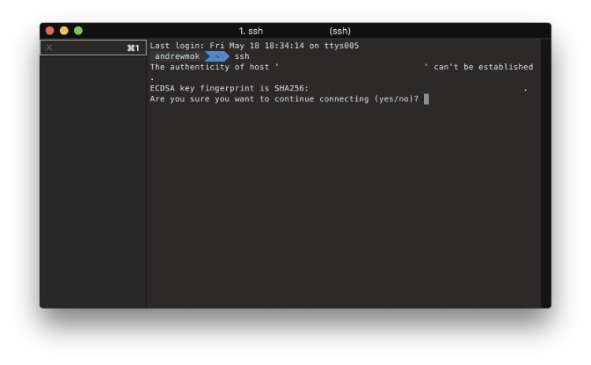
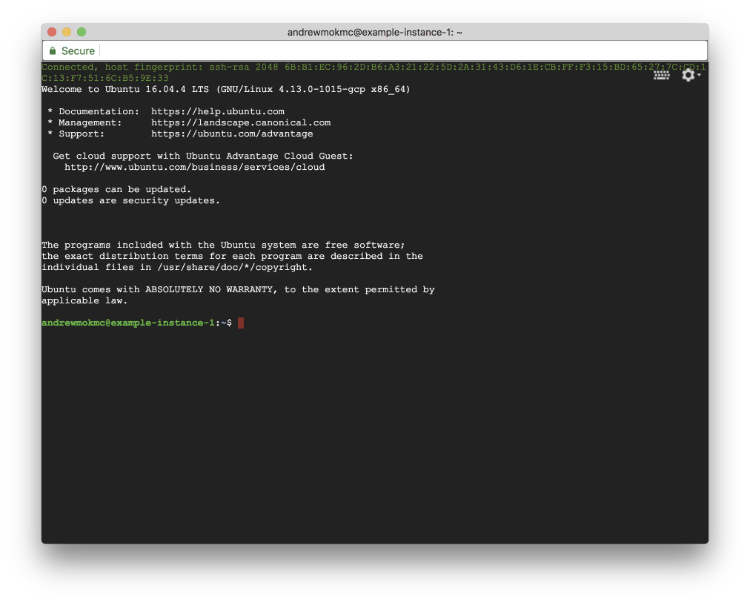
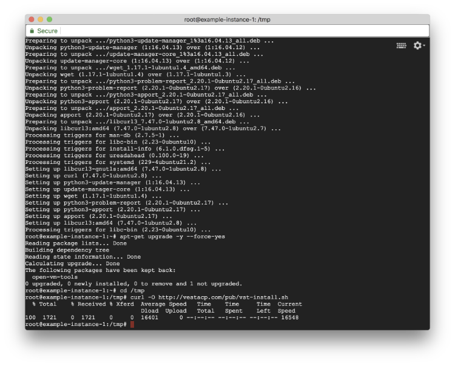
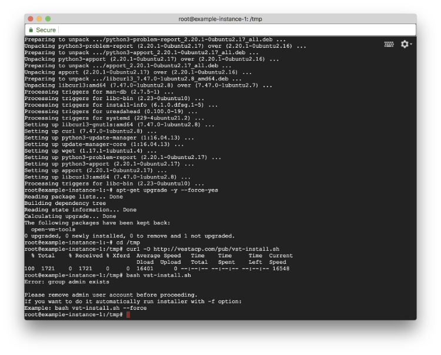
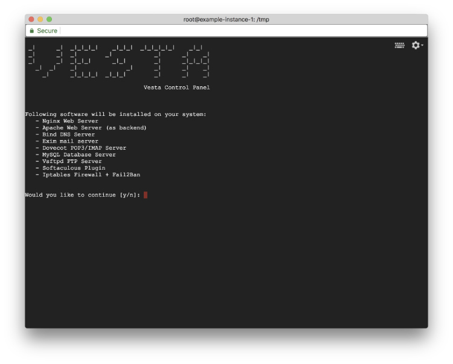
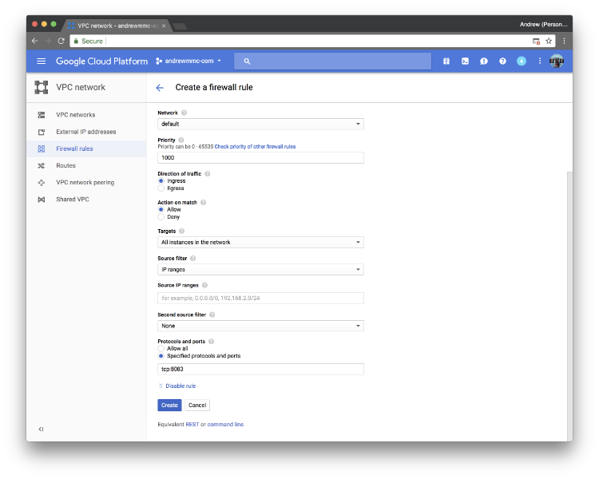
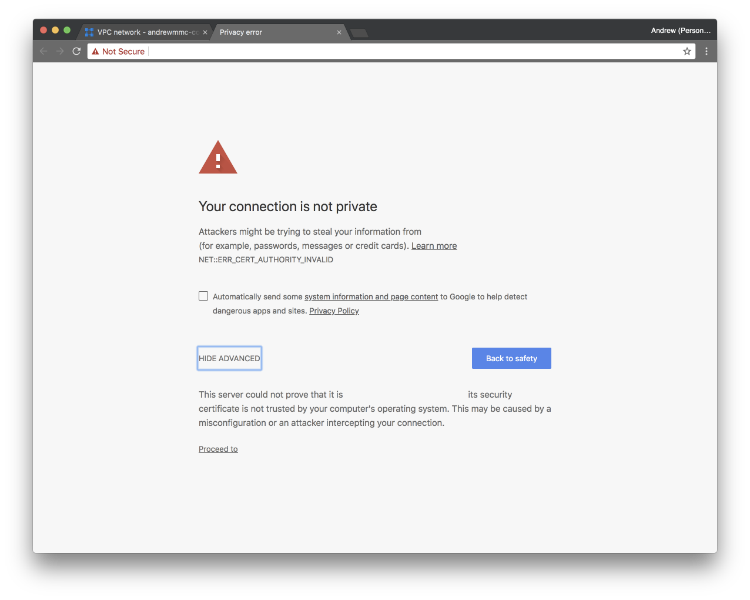
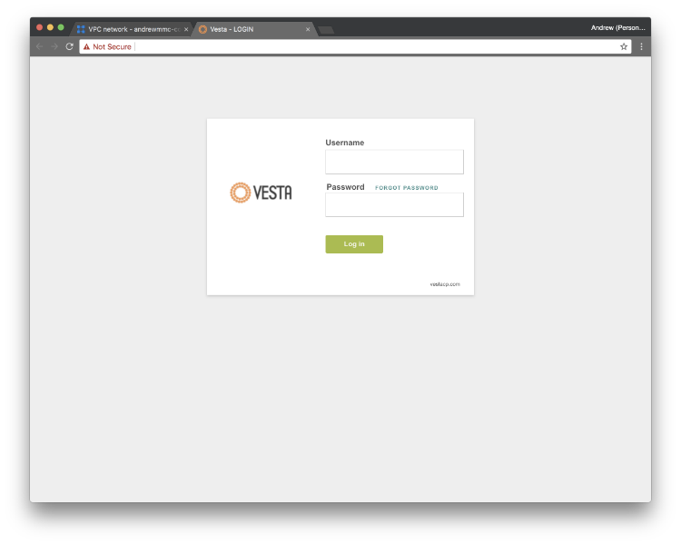

We will continue to install VestaCP with LEMP on the VM instance created.

## 2. Install VestaCP with LEMP on your VM instance

**(1) Enter your instance via SSH connection**

First, open the console on your computer, and connect to your server using SSH. Remember, It is not suggested to log in to root directly with the password.

    $ ssh <USERNAME>@<SERVER_IP>

You may see the authenticity warning when you connect to the server first time. Type yes to continue.If you successfully log in to your server, you will see the following message:

Then switch to root account by typing following command in the console window:

    $ sudo su -

Before downloading VestaCP to the instance, you may need to update and upgrade the packages installed on your server.

    $ apt-get update
    $ apt-get upgrade -y — force-yes

**(2) Download VestaCP install script and install it to the server**

After running above commands, type the commands below to download VestaCP install script to the server.

    $ cd /tmp
    $ curl -O [http://vestacp.com/pub/vst-install.sh](http://vestacp.com/pub/vst-install.sh)

If you would like to customize your installation, you may check [here](http://vestacp.com/install/) for the installation command suggested by VestaCP. Or just simply run below for the default modules:

    $ bash vst-install.sh

If you get the error message that prompting you the admin user group exist, simply add -f after the command and run it again:

You will see an installation screen that showing software will be installed.

Type y to continue the installation progress.

You need to enter your email address and hostname (your domain name) for the installation as well. It may take few minutes to finish the installation progress.

**(3) Expose TCP/8083 port to public for VestaCP**

Before we enter the control panel installed on the server, we need to expose 8083 port to the public in firewall rules as VestaCP is using 8083 port. Go to VPC network and Firewall rules, and click Create firewall rule.

Simply type vestacp as the rule name, and type http-network and https-network in Target tags (You should see the related tags in your machine details).

If you are not sure the correct tags name, you can also choose All instances in the network in the options. In Protocols and ports, type tcp:8083 to expose 8083 port to the public.

After that, click Create and wait for few seconds.

**(4) Mark your admin username and password down**

You will see a successful message in the console after the installation progress. Remember mark your admin username and password down!

After that, go to the panel URL shown on the terminal window (Don’t forget to update the DNS record of your domain!)

You may see the following screen before you enter the control panel. No worries, we will fix this later. Just simply click Proceed to <YOUR_DOMAIN_NAME>.

**Congratulations!** VestaCP is ready. [Check out next post for installing PHP 7.2 for your website.](../vestacp-3)

### Series: Setup Ubuntu 16.04 LEMP server with VestaCP on GCE

* Part 1: [Setup VM instance on Google Cloud Compute Engine](../vestacp-1)
* **Part 2: Install VestaCP with LEMP on your VM instance**
* Part 3: [Upgrade PHP version to 7.2 from 7.0](../vestacp-3)
* Part 4: [Get free SSL Certificates from Let’s Encrypt for your domains](../vestacp-4)
* Part 5: [Apply SSL Certificates to your website and force using HTTPS connections](../vestacp-5)
* Part 6: [Apply SSL certificate by Let’s Encrypt to VestaCP](../vestacp-6)
