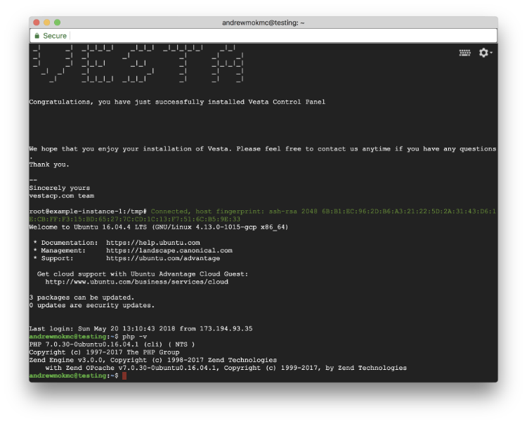
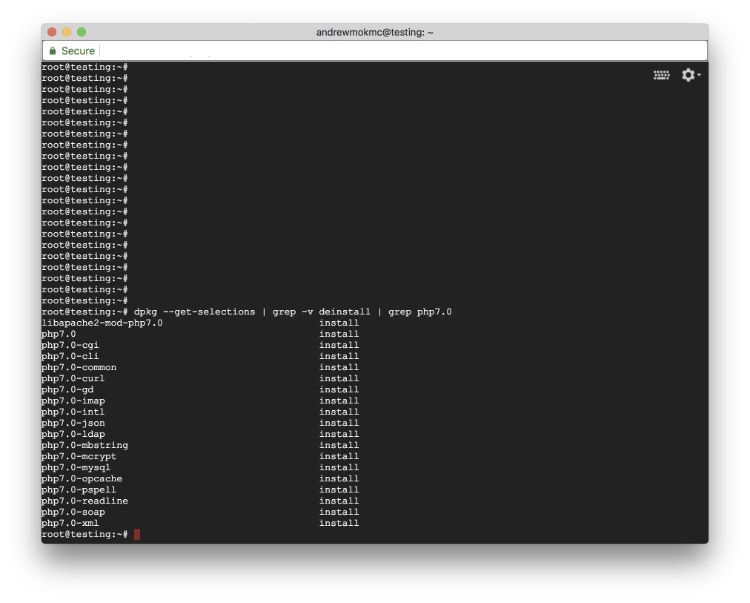
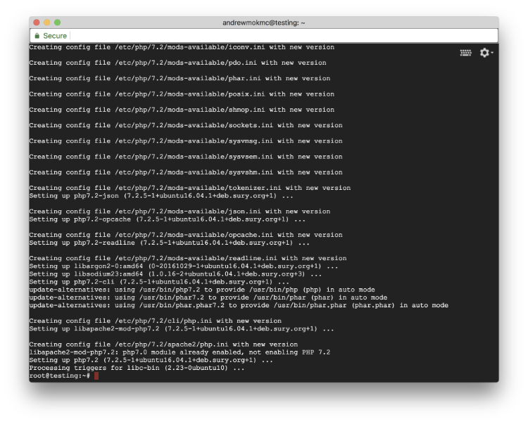
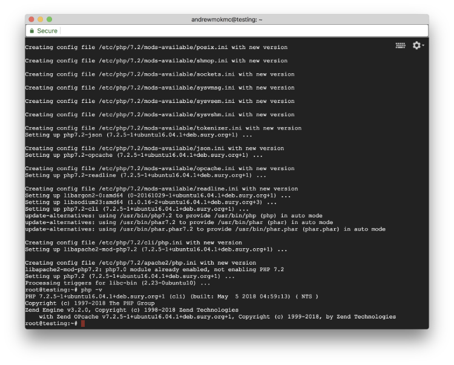
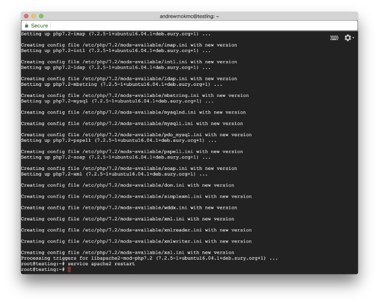

We will continue to upgrade PHP version installed from 7.0 to 7.2.

## 3. Upgrade PHP version to 7.2 from 7.0

**(1) Check your PHP version installed**

First, open the terminal and connect to your server using SSH, and switch to root account access.

```
$ ssh <USERNAME>@<SERVER_IP>
$ sudo su -
```



Before we start, we can simply type the following command to check the existing PHP version installed on the server.

```
$ php -v
```

If you installed Ubuntu 16.04 LTS, you will get PHP 7.0.30 installed on your server by running installation script from VestaCP. In this tutorial, we will upgrade our PHP version to 7.2 to enjoy more features and bug fixes.

**(2) Check your PHP modules installed**



To check installed PHP modules in Ubuntu, type the following command (as Ubuntu makes PHP modules available via packages):

```
$ dpkg - get-selections | grep -v deinstall | grep php7.0
```

Remember mark installed modules list, as you need to install them again after upgraded to PHP 7.2. We don’t need to install mcrypt as it has been dropped from PHP 7.2.

In this tutorial, we need to install those modules again:

```
libapache2-mod-php7.2
php7.2-cgi
php7.2-cli
php7.2-common
php7.2-curl
php7.2-gd
php7.2-imap
php7.2-intl
php7.2-json
php7.2-ldap
php7.2-mbstring
php7.2-mysql
php7.2-opcache
php7.2-pspell
php7.2-readline
php7.2-soap
php7.2-xml
```

**(3) Install PHP 7.2 on your server**



Before we upgrade to PHP 7.2, you need to update your packages list first. Run the following commands to update your packages and install PHP 7.2 on your server:

```
$ apt-get update
$ apt-get install python-software-properties
$ LC_ALL=C.UTF-8 add-apt-repository ppa:ondrej/php
$ apt-get update
$ apt-get install php7.2
```



After installed PHP 7.2, try to run php -v in your console. And you will see PHP 7.2 installed on your server!

**(4) Disable old version PHP on Apache and enable the new version**

However, we need to disable the old version on Apache and tell Apache to use PHP 7.2. Try the following commands:

```
$ a2dismod php7.0
$ a2enmod php7.2
$ service apache2 restart
```

After restarted apache2 service, now PHP 7.2 is finally running on your web server. Though we have the newer version of PHP, we still need to install those modules back.

**(5) Install PHP modules**

We will run the following command to install those modules back. You may install more or fewer modules, depend on your PHP application.

```
$ apt-get install libapache2-mod-php7.2 php7.2-cgi php7.2-cli php7.2-common php7.2-curl php7.2-gd php7.2-imap php7.2-intl php7.2-json php7.2-ldap php7.2-mbstring php7.2-mysql php7.2-opcache php7.2-pspell php7.2-readline php7.2-soap php7.2-xml
```



And yes, restart the apache2 service again.

```
$ service apache2 restart
```

**Congratulations!** PHP 7.2 is now running on your web server. [Check out next post for getting free SSL certificates for your domains.](../vestacp-4)

### Series: Setup Ubuntu 16.04 LEMP server with VestaCP on GCE

* Part 1: [Setup VM instance on Google Cloud Compute Engine](../vestacp-1)
* Part 2: [Install VestaCP with LEMP on your VM instance](../vestacp-2)
* **Part 3: Upgrade PHP version to 7.2 from 7.0**
* Part 4: [Get free SSL Certificates from Let’s Encrypt for your domains](../vestacp-4)
* Part 5: [Apply SSL Certificates to your website and force using HTTPS connections](../vestacp-5)
* Part 6: [Apply SSL certificate by Let’s Encrypt to VestaCP](../vestacp-6)
