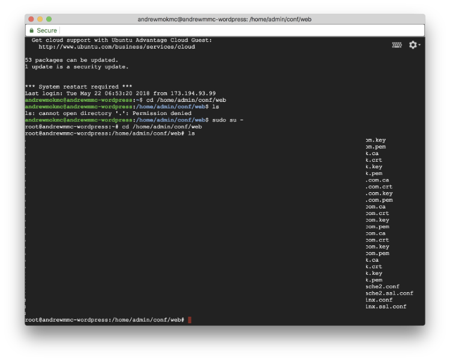
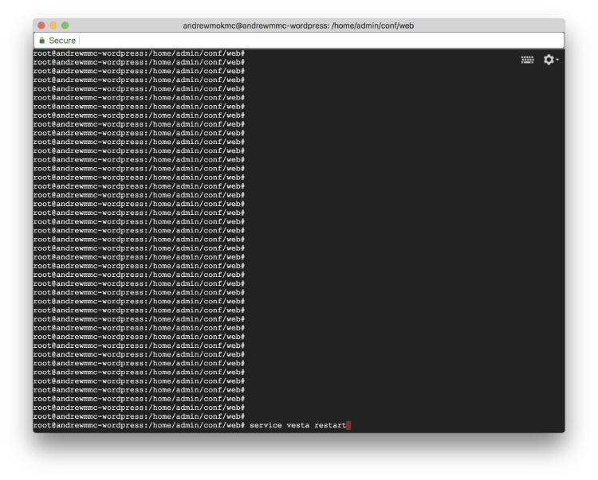

We will continue to apply the certificate to VestaCP as well.

## 6. Apply SSL certificate by Let’s Encrypt to VestaCP

Login to VestaCP using your domain name with port 8083, and navigate to WEB section. Click EDIT next to your domain name.

Make sure that you checked both SSL support and Let’s Encrypt support as we mentioned in last tutorial.

Open the console and connect to your server using SSH. Go to the directory that Let’s encrypt creates and stores the SSL certificates, and list those certificates out.

```
$ cd /home/admin/conf/web
$ ls
```



You will see those files are named in your domain name. For example:

```
ssl.testing.com.ca
ssl.testing.com.crt
ssl.testing.com.key
ssl.testing.com.pem
```

We need to backup the old VestaCP certificate files and create symlinks to those certs created by Let’s encrypt. Run the following commands (replace `testing.com` to your own domain name):

```
$ mv /usr/local/vesta/ssl/certificate.crt /usr/local/vesta/ssl/certificate.crt.bak
$ mv /usr/local/vesta/ssl/certificate.key /usr/local/vesta/ssl/certificate.key.bak
$ ln -s /home/admin/conf/web/ssl.testing.com.crt /usr/local/vesta/ssl/certificate.crt
$ ln -s /home/admin/conf/web/ssl.testing.com.key /usr/local/vesta/ssl/certificate.key
```
Also, fix the file permission as we are no longer using the certificate provided by VestaCP. Run the commands below in the console window:

```
$ cd /home/admin/conf/web/
$ chgrp mail ssl.testing.com.key
$ chmod 660 ssl.testing.com.key
$ chgrp mail ssl.testing.com.crt
$ chmod 660 ssl.testing.com.crt
```



After that, restart VestaCP service on your server.

```
$ service vesta restart
```

**Congratulations!** Close the existing browser window and open a new one. Try to log in to the VestaCP again using your domain name with port 8083. You will see the Let’s encrypt certificate applied to the control panel!

This is the end of this series! Thanks for reading.

### Series: Setup Ubuntu 16.04 LEMP server with VestaCP on GCE

* Part 1: [Setup VM instance on Google Cloud Compute Engine](../vestacp-1)
* Part 2: [Install VestaCP with LEMP on your VM instance](../vestacp-2)
* Part 3: [Upgrade PHP version to 7.2 from 7.0](../vestacp-3)
* Part 4: [Get free SSL Certificates from Let’s Encrypt for your domains](../vestacp-4)
* Part 5: [Apply SSL Certificates to your website and force using HTTPS connections](../vestacp-5)
* **Part 6: Apply SSL certificate by Let’s Encrypt to VestaCP**
