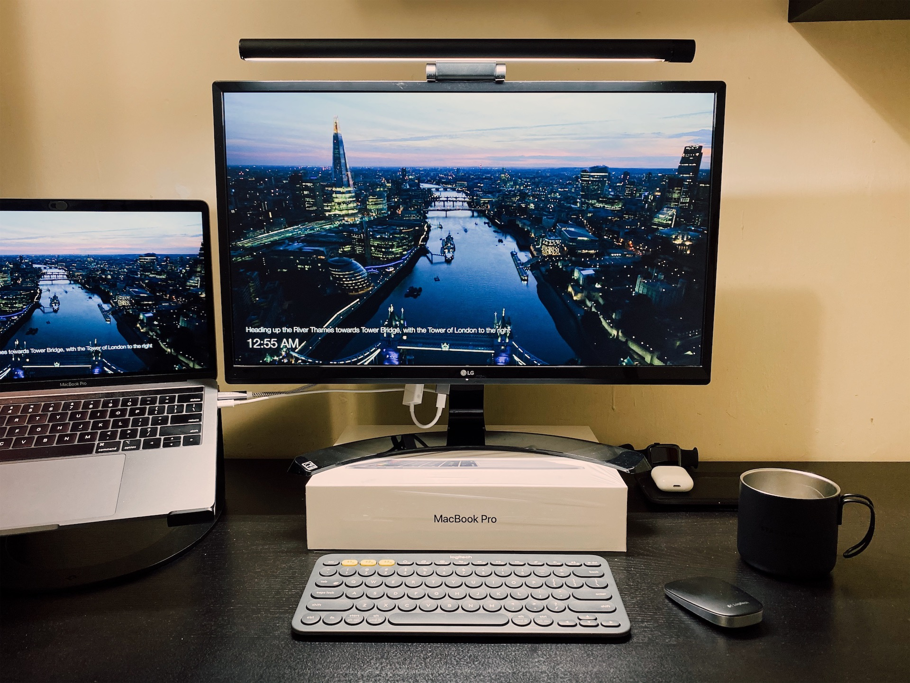
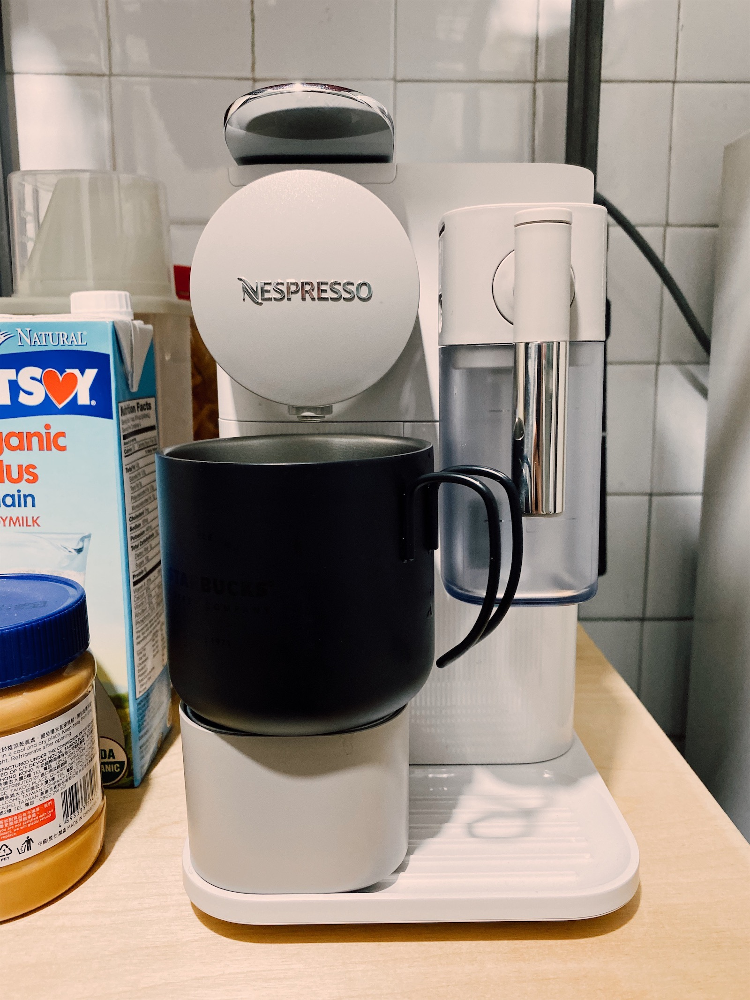

The current COVID-19 outbreak situation has changed the way of how we work. Many of you are already working from home to keep social distancing and stop the spread. It might not be comfortable at the beginning as work from home requires self-discipline, and you may feel not productive when you stay at home.

I like working from home, it not only saves the cost and time on transport but also allows you to stay productive by switching different working environments. Here are some pro-tips to work from home more efficiently:

**1. Set up your workplace**

There can be nothing more important than having a comfortable working space. An organised desk with a comfortable chair is a must for me, and you should try to design your area for work. It helps you to turn into a "working mindset" when you enter a designed working area. This is my setup:

- MacBook Pro
- 24" LG 4K Monitor (24UD58-B)
- Logitech K580 Keyboard and T630 Mouse
- Herman Miller Aeron Chair
- Loctek Standing Desk E3

The keyboard and mouse are not the perfect choices for me right now. I only consider them as the alternatives of Magic Mouse and Magic Keyboard supporting multiple devices. However, the standing desk and chair are good investments for me. It brings my working experience to the next level. As a programmer, I work and relax every day in front of the screen, and they help my back pain.

Lighting is essential too as it creates a mood in the room. I installed tunable bulbs in my room, and I can use the Home app on my iPhone to change the colour temperature. I switch them to daylight mode when I am working and turn back to the soft-white mode for my night time.

**2. Take a bath and get dressed**

You won't wear bedwear to office, and please don't do so when you work from home as well. Try to take a bath and change your clothes before getting to work. Treat it as a "wake-up call" for you and let your mind shift to working mode at home. (Also, it makes your life easier when you get some urgent conference calls!)

**3. Have breakfast**

Yes, another tip is having breakfast. You may feel sleepy in the morning while staying at home. It can be simple: bread with coffee is already enough to wake me up. Don't put too much effort to get your breakfast done.

As a coffee lover, a coffeemaker is a worthy investment to me, and I use it every day before work. (And it saves a lot comparing to buying coffee in Starbucks!)

**4. A daily check-in with the team**

Set up a regular check-in meeting with the team. We call it "Daily Stand-up" in Scrum way. It keeps different workmates in sync. In the daily check-in, we talk three things - What I did yesterday, What I am going to do today, and the blockers need to be resolved. Let the team know your blockers so your managers or teammates can provide you helps on time.

**5. Follow your schedule and priorities**

Work from home is just like having more freedom, so discipline is necessary to keep productivity. Set a schedule and priorities for yourself. Follow your designed plan to work. Having a calendar helps you to track what should you do. It also let you won't miss or forget any meeting. It might not be a 9-to-5-schedule for you, but just let your team know if you have any arrangements on your time.

**6. Take regular breaks**

Separate your work to several focused points like using Pomodoro Technique, or other techniques. In between different time blocks, you can take a short break. Doing a quick workout, watching some random YouTube videos, or anything you feel most comfortable with; then return to work again.

**7. Get connected with communication tools**

It is easy to feel isolated when you work from home. Communication tools are keeping you contacted with your team. There are different options in the market, and some examples below are the tools that my team is using:

- GitLab - Code repositories, project management tool and documentation place
- Mattermost - Alternative of Slack for enterprise collaboration
- Cisco WebEx - Video calls and screen sharing
- and of course, emails and phone calls if needed

Try to turn on the camera to see each other so that you won't feel too lonely. And voice out directly when you need help. When everyone is working from home, we can't see each other face. People may not know you are in stuck or get some blockers. Let other people step in early so they can help you to resolve the blockers immediately.

**8. Stay healthy**

Reserve your time for exercise! Staying at home means you have a lot of time to cook or use the delivery app ordering food. Create an exercise time to remind yourself to stay healthy. It could be any exercise, a walk, run, yoga, HIIT... etc. Just a time to let you get away from the screen.

**9. Enjoy the fun time with the team**

Socialising help you to stay productive and happy. When you worked from home for a long time, you may miss your colleagues. Try to keep your team-building time. In my team, we hold virtual meetings like virtual team lunch and Pictionary time. It can be anything outside work - movie, books, art sharings, etc. Try to take the chance to see your colleagues face for social interactions by turning the camera on!

---

Work from home means **working differently** but not working less. It is built on trust. It might be a challenging time for many people, but why don't consider it as a breaking-change experiment? Remote working becomes a new way for us to work, and it is not happening in future. **It is happening now.**