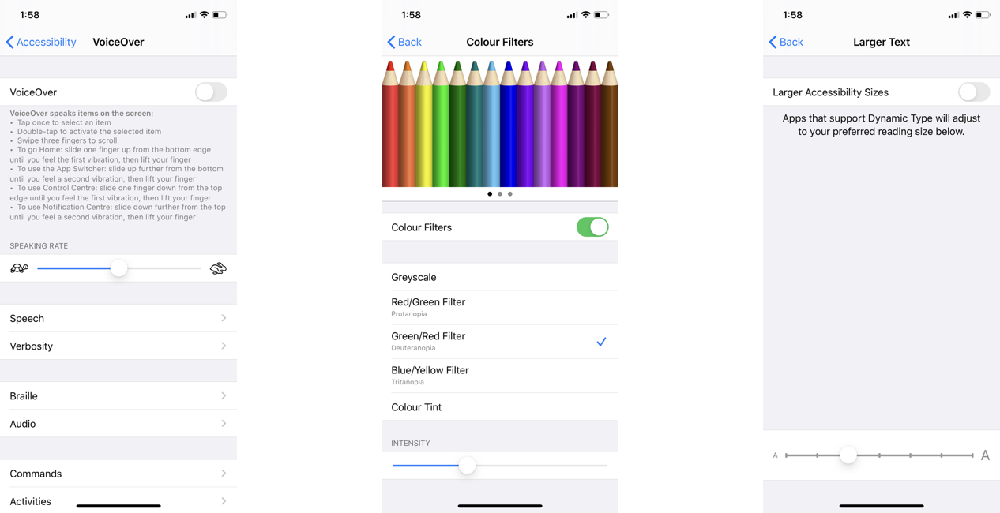
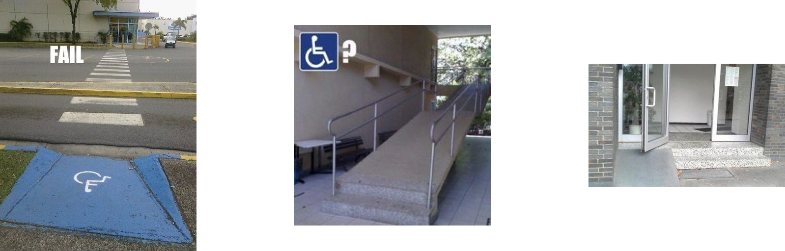
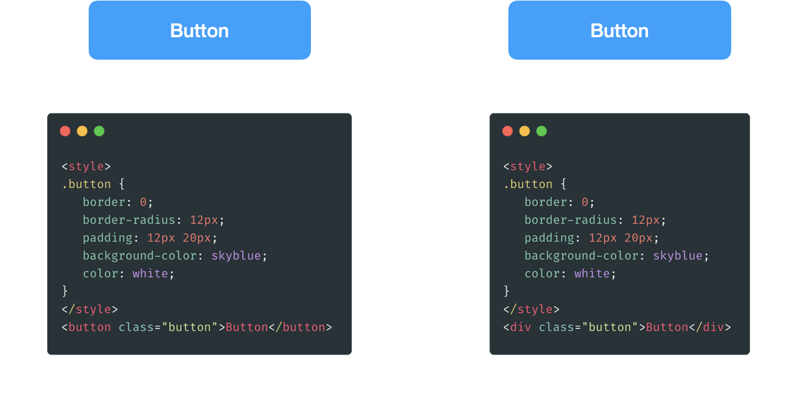
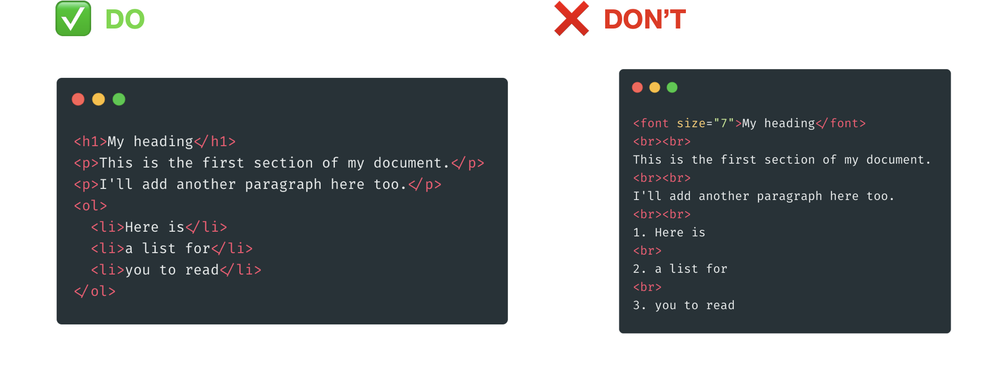
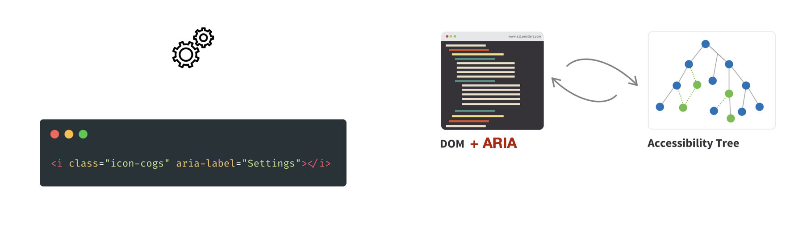
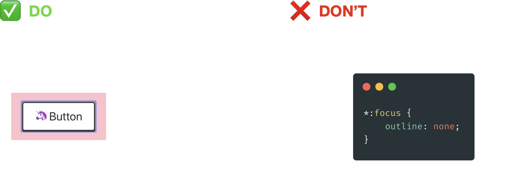
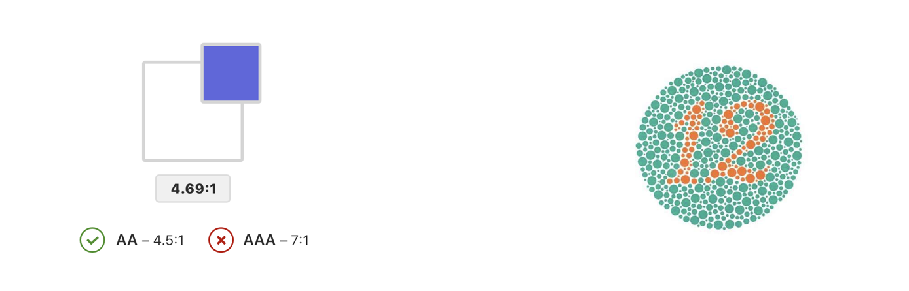

This is the article of my talk. You may check out the presentation slide [here](https://github.com/andrewmmc/share/blob/master/20200521-web-accessibility/index.pdf).

## What is web accessibility?

According to the definition from [W3C](https://www.w3.org/standards/webdesign/accessibility), Web accessibility is a website or tool that designed and developed for everyone, including disabilities. It means everyone in the world should be easy to assess the contents on the website without any barriers.

There are different forms of disabilities in the world. Likes hearing impairment, means someone who is not able to hear clearly; motor impairment, means a partial loss of function of a body part; cognitive disability, means a person has a certain limitation in mental functioning; and vision impairment, means a decreased ability to see.

## So, why web accessibility is so important?

Believe it or not, according to [the data from WHO in 2018](https://www.who.int/news-room/fact-sheets/detail/disability-and-health), actually, there are 15% of the world population have some form of disability. That means every 7 people, there is one person have some form of disability. And the numbers keep increasing because of population ageing and different health conditions.

I don’t know what do you think, but to me, the web is a freedom world that designed for everyone to access it, whatever your hardware, software or ability. It is important to provide equal access and equal opportunity to people with disabilities.

And don’t always assume the user will use the usual way or expected way to use your services or website. Users may rely on Voiceover to get the contents from your website, they may apply a colour filter to their devices. Or even more common, they may enable large text scaling to increase the font size on their devices.



In fact, accessibility failure is *easier to be spotted* in the real world.



However, it might be hard to notice in the software world. As you can see from the examples, both buttons look the same on the users' browsers, but only the left one is representing button to the screen reader. The right one is only the `div` box with styling but no meanings. It is easier to be ignored in software development.



## Oh, you may say that it just a small portion of people. Why do we need to care about that?

First, it not only helps people with physical disabilities. It also helps aged people and people who have temporary disabilities. Moreover, making the website fully keyboard accessible helps some keyboard users like us as well. It also has a big benefit to SEO as Google or other search engines could better understand the content of the website. SEO techniques and accessibility have a lot of overlap, and fixing the accessibility of the site could improve the SEO rating.

## Common mistakes

Of course, I won't list out all the W3C standards here, but let me share some common mistakes that we can avoid.

### Semantic HTML tags

Always following native semantic HTML tags first and avoiding styling HTML tag. It clearly describes the content levels and purpose to the browser.



And this is the example of different semantic tags in HTML 5.
```
<address>
<article>
<aside>
<blockquote>
<code>
<details>
<figcaption>
<figure>
<footer>
<h1>
<header>
<main>
<mark>
<nav>
<ol>
<p>
<section>
<strong>
<sub>
<summary>
<sup>
<time>
<ul>
```
### WAI-ARIA tags

In some cases, semantic tags might not be possible to handle the elements on our website. In this case, we might add ARIA tags to the DOM elements for the screen reader to understand what they are. One common example would be handling icon only elements.



### Focus state and keyboard navigation

And do not set `outline` property to `none`. I do agree that the blue growing outline is a bit ugly, but it is important as it provides visual feedback for the link that has focus state when navigating with the keyboard. If you would like to remove it, consider providing alternative styling. It is an example of YouTube for how they handle the focus state.



### Image captions

Also, add alternative tag or captions for images to describing what is your images representing.


### Design

Don't think that it is just a developer work to do so. Accessibility can be solved at the design stage as well. Keep in mind for colour contrast, hover and focus states, colourblind simulation. In a long way, it stops accessibility problems before users found that.



## Apply rules

Considering apply some linting rules or audit checking, like using a ESLint plugin; or you can even try turning VoiceOver feature on your devices to see how does it look like from the screen reader.

* eslint-plugin-jsx-a11y
* axe-core
* Google Chrome Lighthouse (Audit)
* Stark (Sketch plugin)
* VoiceOver in iPhone or Mac

Web accessibility is not something you can just simply fix without thinking, however it is always good to do it from the beginning. Some countries already set up regulations for accessibility. More importantly, improving accessibility is not helping people with disabilities only, but also everyone.

## Further read

* [MDN web docs - Accessibility](https://developer.mozilla.org/en-US/docs/Learn/Accessibility)
* [Google Web Fundamentals - Accessibility](https://developers.google.com/web/fundamentals/accessibility)
* [Accessibility in government - GOV.UK blogs](https://accessibility.blog.gov.uk)
* [The A11Y Project](https://a11yproject.com)
* [A11ymatters](https://www.a11ymatters.com)

## References

* Apple. (2017). What’s New in Accessibility. Retrieved from <https://developer.apple.com/videos/play/wwdc2017/215>
* Arvin H. (2019). Importance of Web Accessibility. Retrieved from <https://blog.techbridge.cc/2019/10/13/web-accessibility-intro>
* Dan Na. (2017). Creating an Accessibility Engineering Practice. Retrieved from <http://a11y.danielna.com>
* Stereobooster. (2019). The Button. Retrieved from <https://dev.to/stereobooster/the-button-3kme>
* W3C. (2020). Accessibility. Retrieved from <https://www.w3.org/standards/webdesign/accessibility>