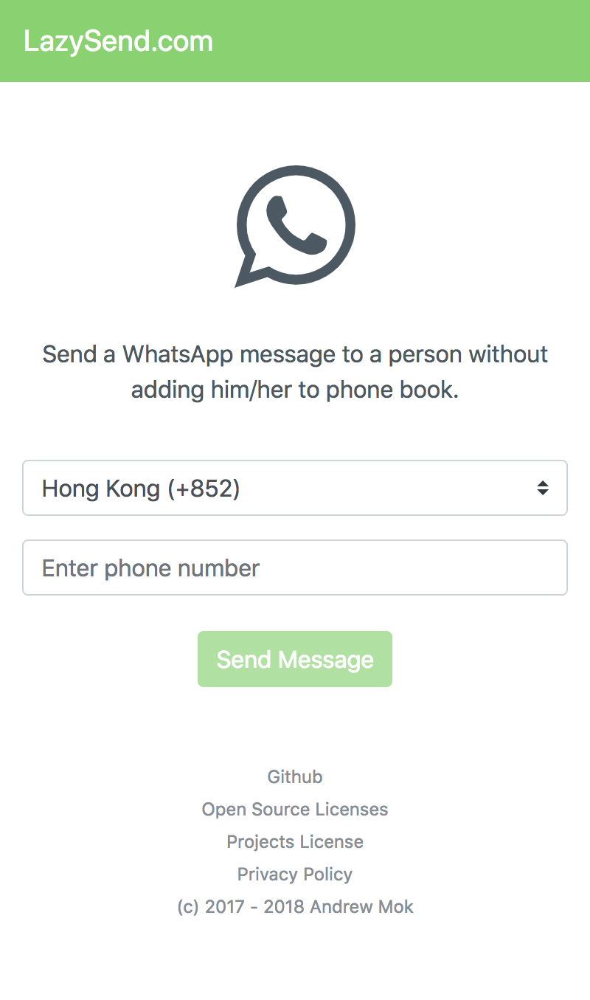

Built with [Vue](https://vuejs.org/), PWA.

It is so stupid that I have to add a new person every time to phone book because I want to send a WhatsApp message to him/her.

That's why I make this simple progressive web application. It allows you to send a WhatsApp message to a person without adding him/her to the phone book.

