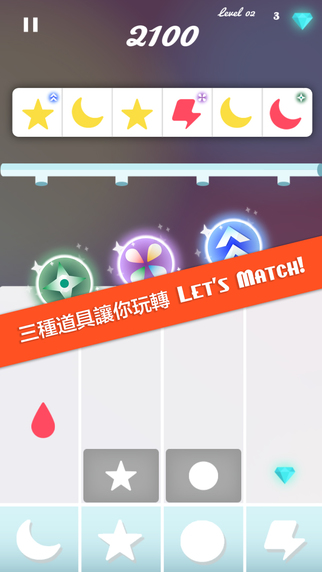
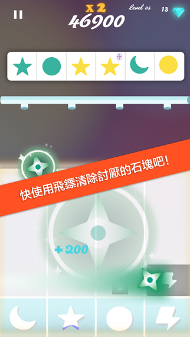
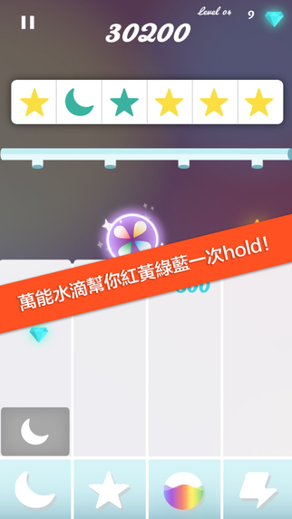
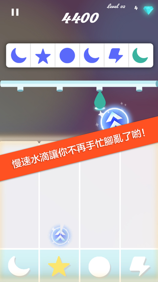

Available for [iPhone](https://itunes.apple.com/us/app/lets-match!-for-iphone/id1032753937) and [iPad](https://itunes.apple.com/us/app/lets-match!-for-ipad/id1028977426).

Let’s Match! is a music game for ADHD children, with professional backgrounds supporting and authentic testing. There are three magic power ups will help players win the game. By swiping water and tapping water, players need to clear the blocks generated by matching water colors.

