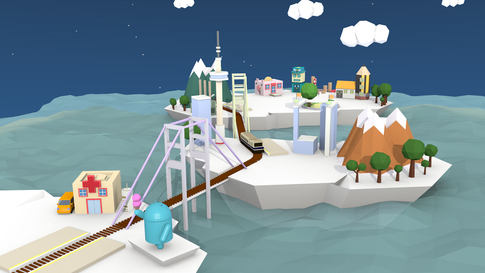

It is a course work that to create a game environment design. Low polygon style illustrations are mainly used and it looks like origami artworks. The graphic style is mainly low-detailed, faceted models, highly rendered and with soft lighting effect.

* [Youtube](https://youtube.com/watch?v=YnQOY71bn_c)
* [Style Guide](/downloads/cityland_styleguide.pdf)
* [Presentation](/downloads/cityland_presentation.pdf)

