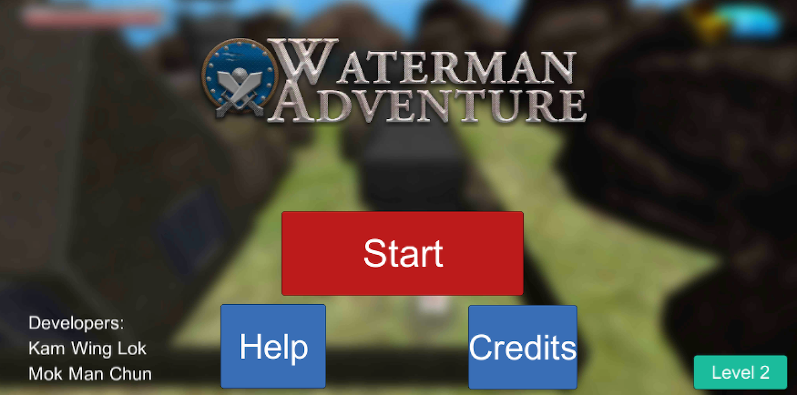
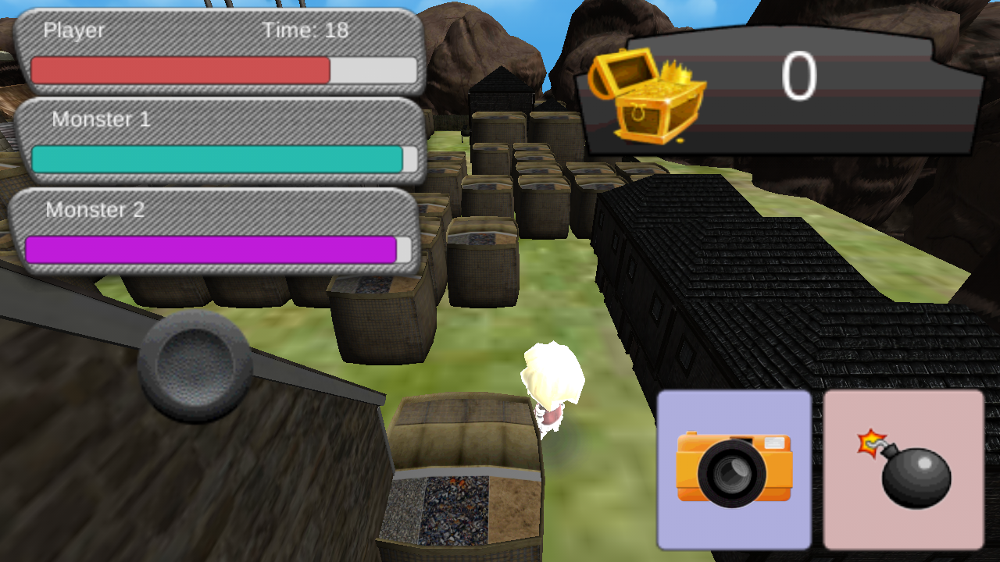
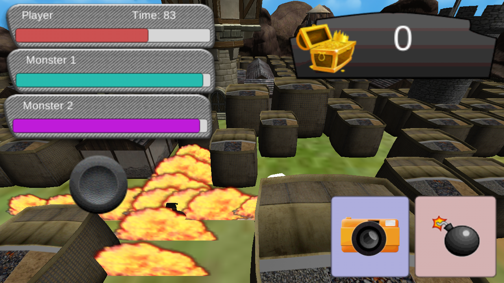
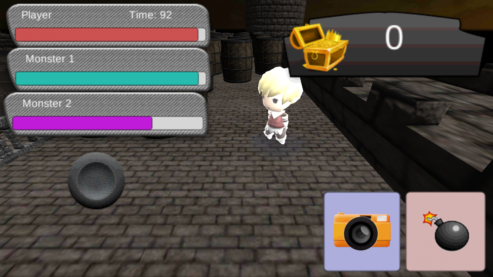
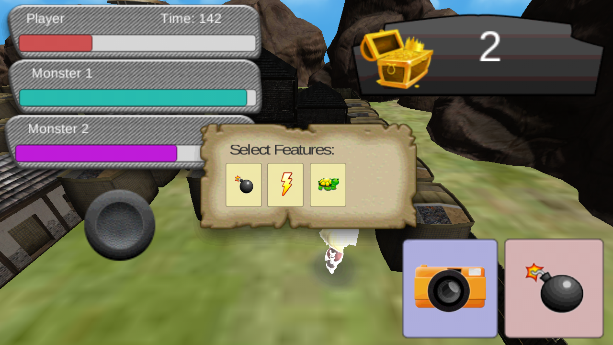
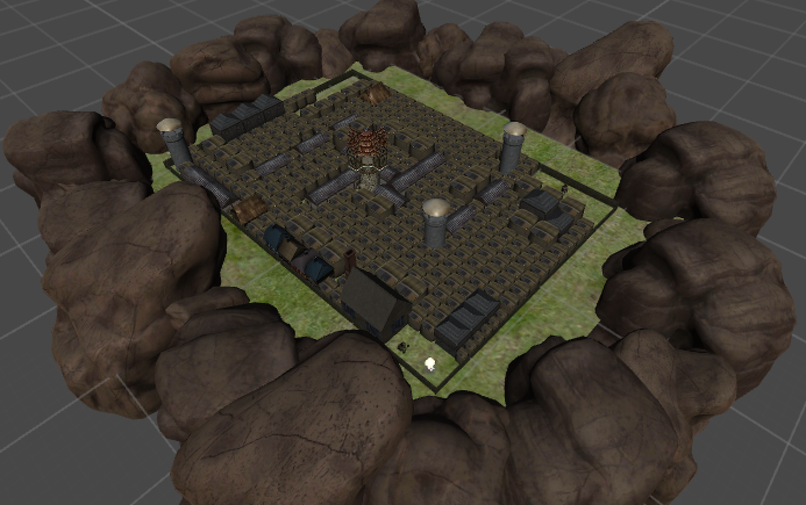

Bulit with [Unity](https://unity3d.com).

It is a course project that developing a bombman based game. The game environment is maze-base design. The game goal is to complete game levels by placing bombs in order to kill enemies and destroy particular obstacles with a high score. The bombs in the game can set off injure enemies or player themselves and destroy obstacles. Player can also get bonus items by destroying barriers.

