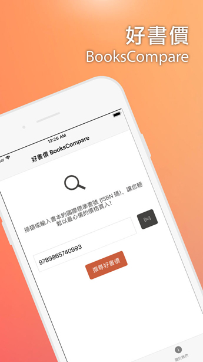

[View on GitHub](https://github.com/andrewmmc/bookscompare-app)

Built with [React Native](https://facebook.github.io/react-native/), available on [App Store](http://bit.ly/bookscompare) and [Google Play](http://bit.ly/bookscompare-android).

BooksCompare allows you to compare pricing on online bookstore by scanning books barcode, so you can always buy your favourite books at the lowest price!

Want to know the price of the book on different bookstores? No need to worry about buying them expensive!

BooksCompare makes you take the books away with lowest prices!

By BooksCompare, you can:

- Find out the basic information of the book including press and author name
- Compare books pricing from major online bookstores in Taiwan.
- Direct link to online bookstores to purchase books

