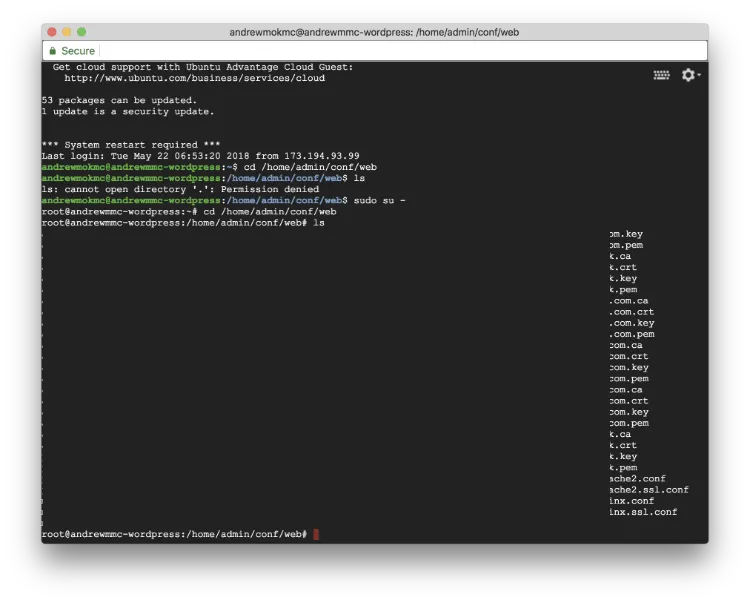
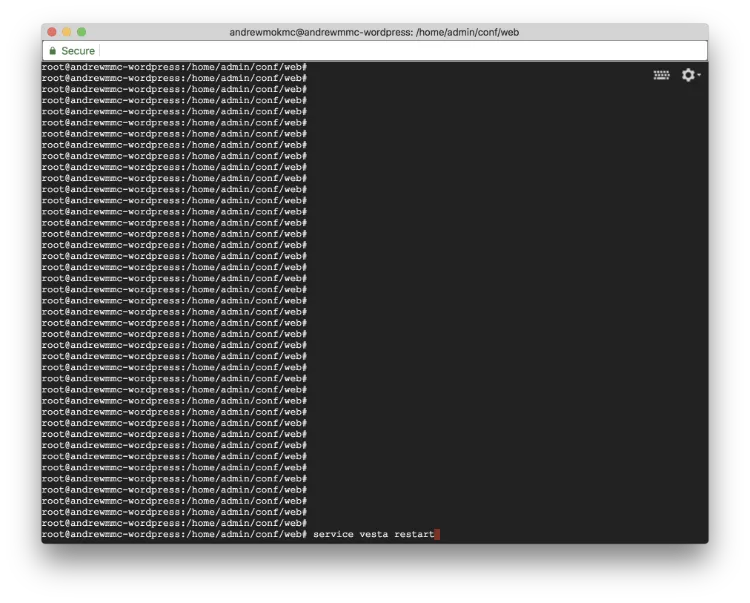

#### 在 GCE 上以 VestaCP 建立 Ubuntu 16.04 LEMP 伺服器（第 6 部分）

在[上一篇文章](/blog/apply-ssl-certificates-to-your-website-and-force-using-https-connections/zh-hant/)中，我們談到如何把憑證套用到網站，並強制使用 HTTPS 連線。這一篇會繼續說明如何把憑證也套用到 VestaCP。


### 6. 使用 Let's Encrypt 為 VestaCP 套用 SSL 憑證

以你的網域名稱加上 8083 埠登入 VestaCP，進入 `WEB` 區塊，然後在網域名稱旁邊按下 `EDIT`。

請確認你已經像上一篇教學提到的一樣，勾選了 `SSL support` 及 `Let's Encrypt support`。

打開終端機並透過 SSH 連線到你的伺服器。前往 Let's Encrypt 建立並儲存 SSL 憑證的目錄，然後把檔案列出來。

```
$ cd /home/admin/conf/web
$ ls
```



你會看到這些檔案是以你的網域名稱命名，例如：

```
ssl.testing.com.ca
ssl.testing.com.crt
ssl.testing.com.key
ssl.testing.com.pem
```

接著，我們需要先備份舊的 VestaCP 憑證檔，再把 Let's Encrypt 產生的憑證建立為符號連結。執行以下指令（請把 `testing.com` 換成你的網域名稱）：

```
$ mv /usr/local/vesta/ssl/certificate.crt /usr/local/vesta/ssl/certificate.crt.bak
$ mv /usr/local/vesta/ssl/certificate.key /usr/local/vesta/ssl/certificate.key.bak
$ ln -s /home/admin/conf/web/ssl.testing.com.crt /usr/local/vesta/ssl/certificate.crt
$ ln -s /home/admin/conf/web/ssl.testing.com.key /usr/local/vesta/ssl/certificate.key
```

此外，由於我們不再使用 VestaCP 原本提供的憑證，也要修正檔案權限。在終端機執行以下指令：

```
$ cd /home/admin/conf/web/
$ chgrp mail ssl.testing.com.key
$ chmod 660 ssl.testing.com.key
$ chgrp mail ssl.testing.com.crt
$ chmod 660 ssl.testing.com.crt
```



完成後，重新啟動伺服器上的 VestaCP 服務。

```
$ service vesta restart
```

**恭喜！** 關閉目前的瀏覽器視窗後再重新開啟，嘗試以你的網域名稱與 8083 埠再次登入 VestaCP。你就會看到控制台已經套用了 Let's Encrypt 憑證！

這個系列到這裡就結束了，謝謝閱讀。
