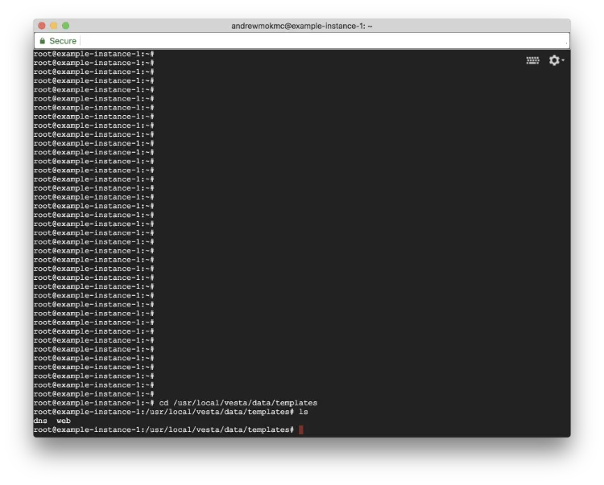
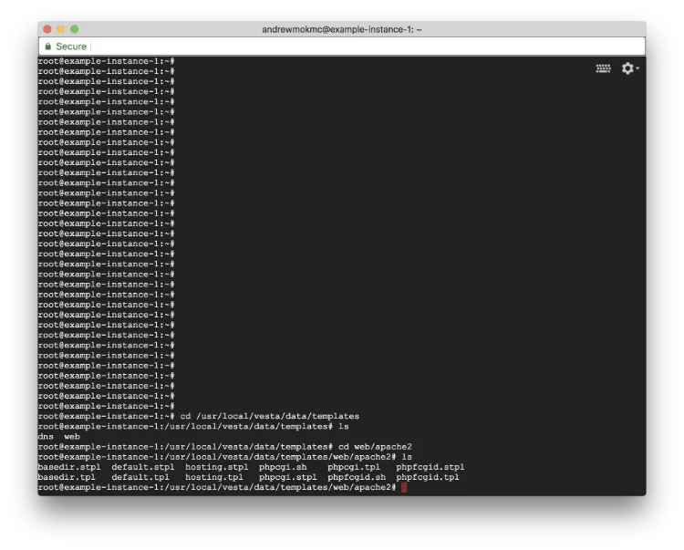
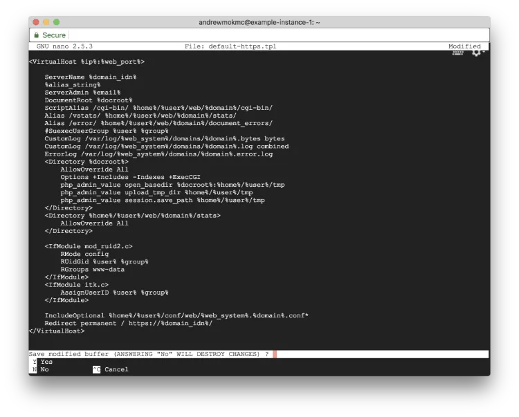
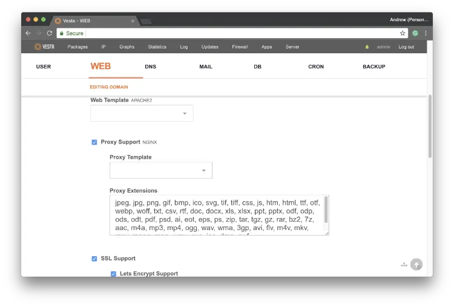

#### Setup Ubuntu 16.04 LEMP server with VestaCP on GCE (Part 5)

In the [previous article](/blog/get-free-ssl-certificates-from-lets-encrypt-for-your-domains/), we talked about how to get free SSL certificates for our domains. In this article, we will continue to apply certificates to our websites and force our users to use HTTPS connections.


### 5. Apply SSL Certificates to your website and force using HTTPS connections



As you installed `certbot` to serve your SSL Certificates on your server, it is a time to apply those certificates to your domains. Type the following command to list the website config templates directories used by VestaCP.

```
$ cd /usr/local/vesta/data/templates
$ ls
```

It includes `nginx` and `Apache` config templates used by VestaCP in `web` folder. We change the `Apache` configuration files first. Go to the `apache2` folder and list out those templates inside by the command:

```
$ cd web/apache2
$ ls
```



There are different config templates used VestaCP for Apache. Normally, `default` should work well for most sites. If you would like to know more about those template files, please [check here](https://vestacp.com/docs/#template-description) for the description.

There are at least two files for each config template. `*.tpl` is for HTTP connection, and `*.stpl` is the same thing but for HTTPS connection. Here we can copy the default config template to new files by following commands:

```
$ cp default.tpl default-https.tpl
$ cp default.stpl default-https.stpl
```

As the `certbot` installed on our server will handle out the SSL distribution, we can force our HTTP connection to use HTTPS. We will create a new config template redirect user to use HTTPS connection if they enter the website via HTTP connection. Type the following command in the console window:

```
$ nano default-https.tpl
```



Edit the `default-https.tpl` file created before and add the following contents above the closing `` line.

```
Redirect permanent / https://%domain_idn%/
```

Save the config template file. Please note that we only need to change the `default-https.tpl` file. We don't need to make any modification to `default-https.stpl` file as we would like to redirect HTTP connection only.

After that, we need to update our `nginx` config files as well. Type the following commands:

```
$ cd /usr/local/vesta/data/templates/web
$ wget http://c.vestacp.com/0.9.8/rhel/force-https/nginx.tar.gz
$ tar -xzvf nginx.tar.gz
$ rm -f nginx.tar.gz
```

We don't need to do any modification in this part. The above commands will download the `nginx` config template provided by VestaCP and extract it to correct location on the server.


It is almost done. Login to VestaCP using your domain name with port 8083, and navigate to `WEB` section. Click `EDIT` next to your domain name to update the settings.



For Web Template `apache2`, change it to `default-https`. For Proxy Support `nginx`, change it to `force-https`. Make sure that you checked both `SSL support` and `Let's Encrypt support`. Then click on `Save`.

**Congratulations! **From now on, your website will have SSL enabled with forced HTTPS connection. [Check out the next post for applying SSL certificate to VestaCP](/blog/apply-ssl-certificate-by-let-s-encrypt-to-vestacp/).
