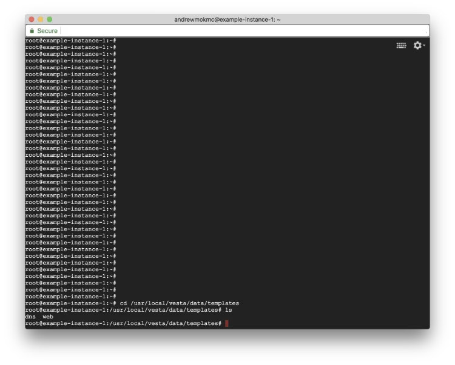
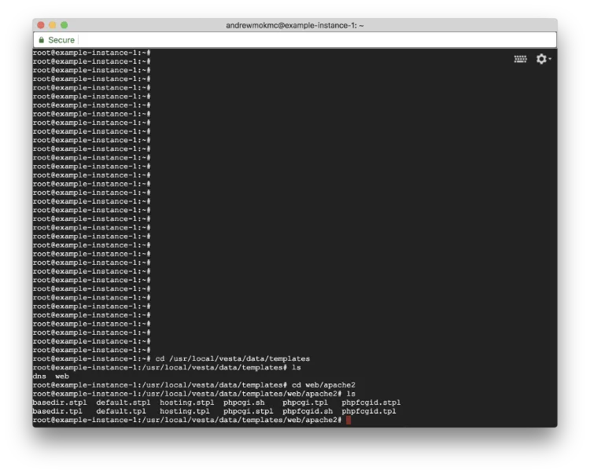
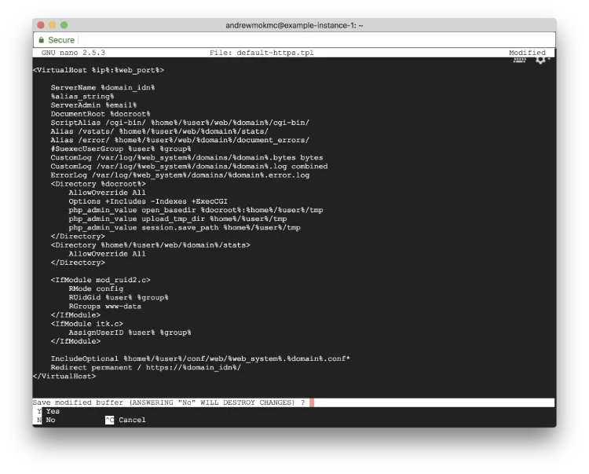
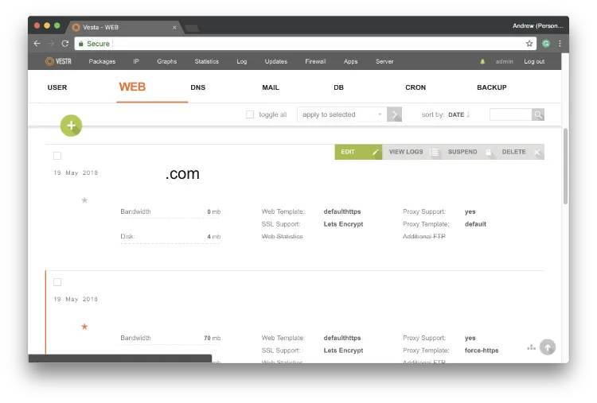
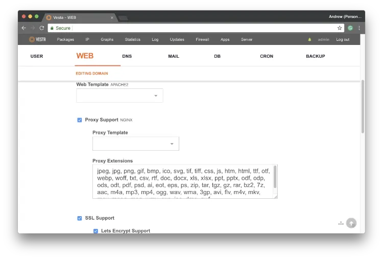

#### 在 GCE 上以 VestaCP 建立 Ubuntu 16.04 LEMP 伺服器（第 5 部分）

在[上一篇文章](/blog/get-free-ssl-certificates-from-let-s-encrypt-for-your-domains/zh-hant/)中，我們談到如何為網域取得免費的 SSL 憑證。這一篇會繼續把憑證套用到網站上，並強制所有使用者透過 HTTPS 連線。


### 5. 為網站套用 SSL 憑證並強制使用 HTTPS



既然你已經安裝了 `certbot` 來在伺服器上管理 SSL 憑證，下一步就是把這些憑證套用到各個網域。先輸入以下指令，列出 VestaCP 使用的網站設定範本目錄。

```
$ cd /usr/local/vesta/data/templates
$ ls
```

當中的 `web` 資料夾內會包含 `nginx` 與 `Apache` 的設定範本。這裡我們先修改 `Apache` 的設定檔。進入 `apache2` 目錄後，用以下指令列出裡面的範本：

```
$ cd web/apache2
$ ls
```



VestaCP 為 Apache 提供了不同的設定範本。一般情況下，`default` 已經足夠大多數網站使用。如果你想進一步了解這些範本檔案，可以參考[官方說明](https://vestacp.com/docs/#template-description)。

每一組範本至少會有兩個檔案：`*.tpl` 用於 HTTP 連線，`*.stpl` 則是 HTTPS 版本。我們先把預設範本複製成新檔案：

```
$ cp default.tpl default-https.tpl
$ cp default.stpl default-https.stpl
```

由於伺服器上的 `certbot` 會幫我們處理 SSL 憑證，我們可以直接把 HTTP 連線重新導向到 HTTPS。請在終端機輸入以下指令：

```
$ nano default-https.tpl
```



編輯剛才建立的 `default-https.tpl`，並在檔案結尾前加入以下內容。

```
Redirect permanent / https://%domain_idn%/
```

儲存設定檔即可。請留意，這裡只需要修改 `default-https.tpl`，因為我們只希望把 HTTP 重新導向到 HTTPS，不需要調整 `default-https.stpl`。

完成後，還需要一併更新 `nginx` 的設定檔。請輸入以下指令：

```
$ cd /usr/local/vesta/data/templates/web
$ wget http://c.vestacp.com/0.9.8/rhel/force-https/nginx.tar.gz
$ tar -xzvf nginx.tar.gz
$ rm -f nginx.tar.gz
```

這個步驟不需要額外修改內容。以上指令會下載 VestaCP 提供的 `nginx` 設定範本，並解壓到伺服器上的正確位置。



差不多完成了。請用你的網域名稱和 8083 port 登入 VestaCP，進入 `WEB` 區塊，然後在對應網域旁邊按 `EDIT` 更新設定。



在 `Web Template` 的 `apache2` 改成 `default-https`，而 `Proxy Support` 的 `nginx` 則改成 `force-https`。另外請確認 `SSL support` 與 `Let's Encrypt support` 都有勾選，最後按下 `Save`。

**恭喜！** 由現在開始，你的網站已經啟用 SSL，並會強制使用 HTTPS 連線。[下一篇會繼續介紹如何把 SSL 憑證套用到 VestaCP 本身。](/blog/apply-ssl-certificate-by-let-s-encrypt-to-vestacp/zh-hant/)
