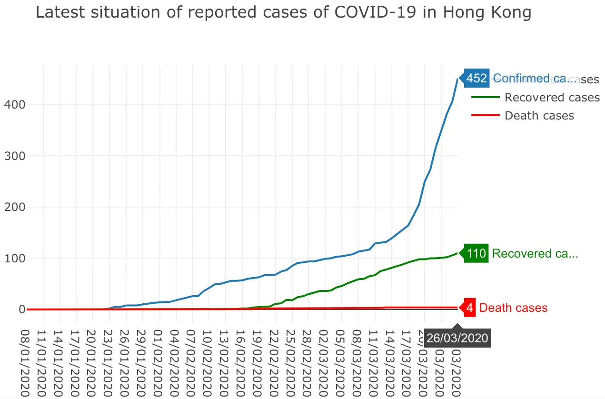
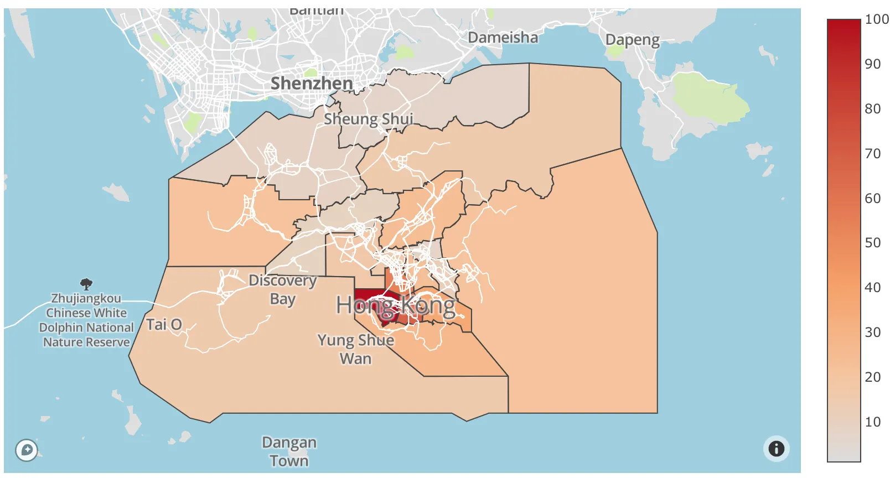
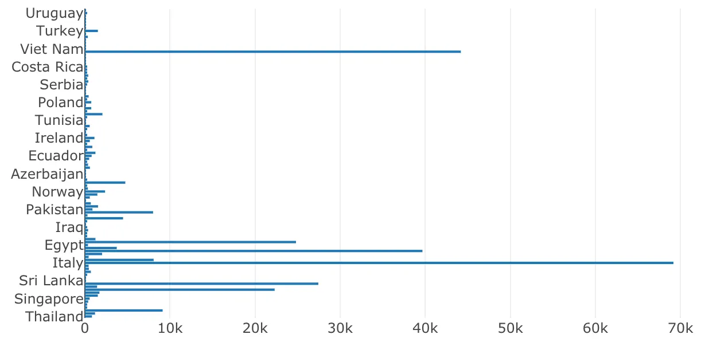

While the world is under uncertainty of COVID-19, we have faced a stress health care system, economic recession and panic feeling. Many people are terrified of the pandemic, and it might be very hard to face the current situation.

We might not be the one who can change the situation, but there is no harm for us to take a look at the data for more information and prediction. I am writing to cover in this article, for visualizing COVID-19 data by a lot of charts from different sources.

### Data sources for tracking

There are different sources of data provided by the local government and universities, for the key statistics of COVID-19 such as confirmed cases numbers and testing numbers.

**Hong Kong**

- [Data in Coronavirus Disease (COVID-19)](https://data.gov.hk/en-data/dataset/hk-dh-chpsebcddr-novel-infectious-agent)

**United States**

- [The COVID Tracking Project](https://covidtracking.com/)

**Worldwide**

- [CSSEGISandData/COVID-19](https://github.com/CSSEGISandData/COVID-19)
- [beoutbreakprepared/nCoV2019](https://github.com/beoutbreakprepared/nCoV2019)

### Data visualizations with Observable Notebook and Plotly

In this article, I am going to create some data visualizations on Observable Notebook. If you heard Jupyter Notebook before — Observable Notebook is something similar but in JavaScript. It’s a web application created by the author of D3.js, Mike Bostock. I used Plotly as well, a chart library for creating interactive data charts.

As a Hongkonger, I would like to visualize some data related to my daily life — I used the data sources from the Hong Kong government, to create serval charts below. **You may click on the links below, to see how I use Observable Notebook to fetch data from Public APIs and turn them into charts.**

#### Latest situation of reported cases of COVID-19 in Hong Kong

#### Buildings in which confirmed cases have resided in past 14 days

#### How COVID-19 spread to the World (Outside Mainland China)

### Other Data Portals for COVID-19

And of course, the charts above is just a try for me to make good use on the available data. There are different visualization projects on COVID-19, and it helps to make confident decisions with data.

- [Coronavirus Disease (COVID-19) in HK](https://chp-dashboard.geodata.gov.hk/covid-19/en.html)
- [COVID-19 Cases Dashboard by Tableau](https://public.tableau.com/profile/covid.19.data.resource.hub#!/vizhome/COVID-19Cases_15840488375320/COVID-19Cases)
- [COVID-19 Dashboards](https://covid19dashboards.com/)
- [Coronavirus COVID-19 Global Cases by JHU](https://www.arcgis.com/apps/opsdashboard/index.html)

### And… Please stay home if you can

Keep the social distancing to limit your exposure to other people in this difficult period. It’s not only protecting yourself but also protecting the community to slow down the transmission of COVID-19. Please stay at home if you can, and avoid gatherings with friends.

---

**The days ahead will be not easy for every person in the world, especially when we see some bad numbers keep going up day by day. **However, the pandemic will still over in someday. We have to learn how to live in this uncertain world and stay positive while no one knows what will the future be. Live for today, love the people around you and treasure what you have, and never lose hope.
