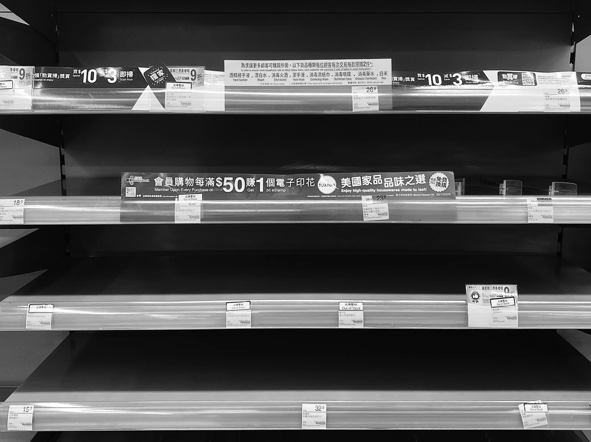
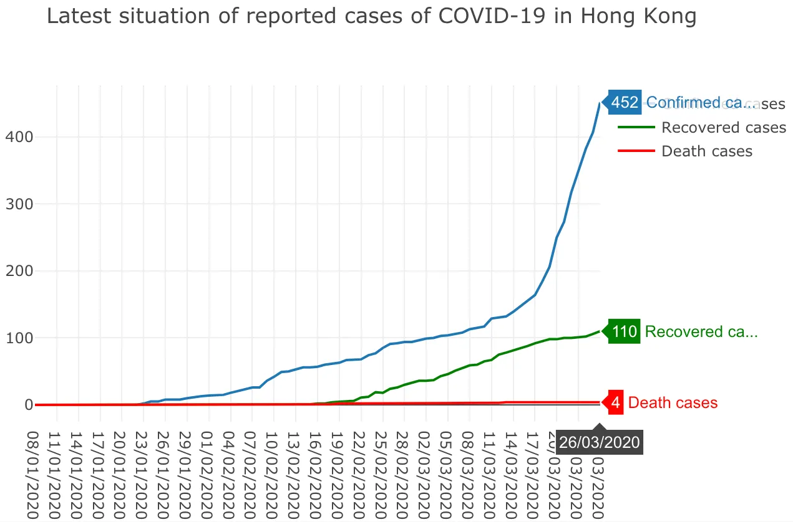
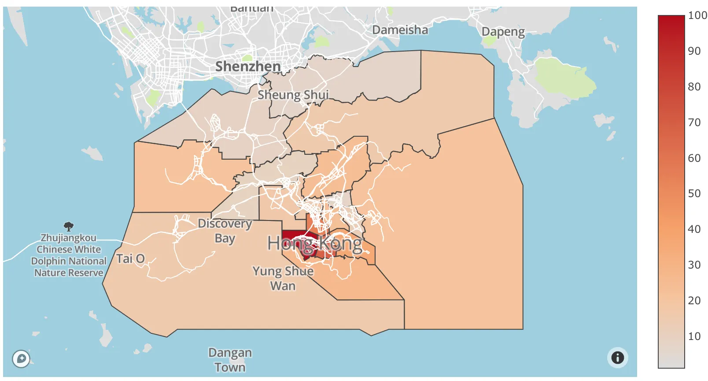
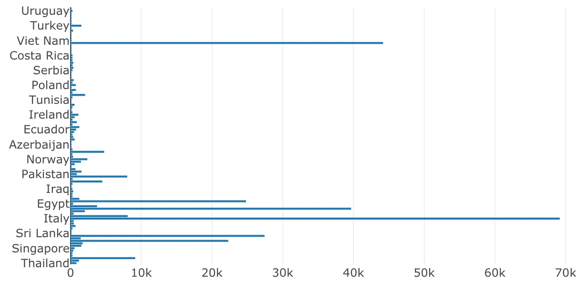

當全球都籠罩在 COVID-19 的不確定性之下，我們面對的是緊張的醫療系統、經濟衰退，以及人心惶惶的情緒。很多人都對這場疫情感到害怕，而面對現在的局勢確實不容易。

或許我們未必能夠直接改變局面，但從數據中了解更多資訊與趨勢，總是有幫助的。這篇文章會記錄我如何利用不同來源的資料，製作幾個與 COVID-19 相關的圖表。

### 用來追蹤疫情的資料來源

本地政府與大學都提供了不少資料來源，當中包含 COVID-19 的關鍵統計資料，例如確診個案數字與檢測數字。

**香港**

- [Data in Coronavirus Disease (COVID-19)](https://data.gov.hk/en-data/dataset/hk-dh-chpsebcddr-novel-infectious-agent)

**美國**

- [The COVID Tracking Project](https://covidtracking.com/)

**全球**

- [CSSEGISandData/COVID-19](https://github.com/CSSEGISandData/COVID-19)
- [beoutbreakprepared/nCoV2019](https://github.com/beoutbreakprepared/nCoV2019)

### 用 Observable Notebook 與 Plotly 製作資料視覺化

在這篇文章裡，我打算在 Observable Notebook 上建立一些資料視覺化圖表。如果你聽過 Jupyter Notebook，Observable Notebook 可以理解成 JavaScript 世界裡相似的東西。它是由 D3.js 作者 Mike Bostock 建立的網頁應用。我同時也用了 Plotly 這個圖表函式庫來建立互動式圖表。

作為香港人，我想先從與日常生活較相關的資料出發，因此使用了香港政府提供的資料來製作以下幾個圖表。**你可以點擊下面的連結，查看我是如何在 Observable Notebook 中從公開 API 取得資料並轉成圖表的。**

#### 香港最新 COVID-19 已通報個案情況

#### 過去 14 天曾有確診者居住的大廈

#### COVID-19 如何擴散到世界各地（中國大陸以外）

### 其他與 COVID-19 相關的資料平台

當然，上面的圖表只是我一次嘗試，想看看如何善用現有資料。其實市面上已有不少與 COVID-19 相關的資料視覺化專案，也能幫助大家以數據作出更有信心的判斷。

- [Coronavirus Disease (COVID-19) in HK](https://chp-dashboard.geodata.gov.hk/covid-19/en.html)
- [COVID-19 Cases Dashboard by Tableau](https://public.tableau.com/profile/covid.19.data.resource.hub#!/vizhome/COVID-19Cases_15840488375320/COVID-19Cases)
- [COVID-19 Dashboards](https://covid19dashboards.com/)
- [Coronavirus COVID-19 Global Cases by JHU](https://www.arcgis.com/apps/opsdashboard/index.html)

### 如果可以，請留在家中

在這段艱難的時期，保持社交距離，盡量減少與其他人的接觸。這不只是保護自己，也是保護整個社區，減慢 COVID-19 的傳播速度。如果可以，請留在家裡，並避免與朋友聚會。

---

**未來的日子對世界上每一個人來說都不容易，特別是當我們看著一些令人難過的數字日復一日地上升。** 不過，疫情終有一天會過去。我們要學會在這個充滿不確定性的世界裡生活，並在無法預知未來的情況下保持正面。好好活在當下，珍惜身邊的人和你所擁有的一切，千萬不要失去希望。
