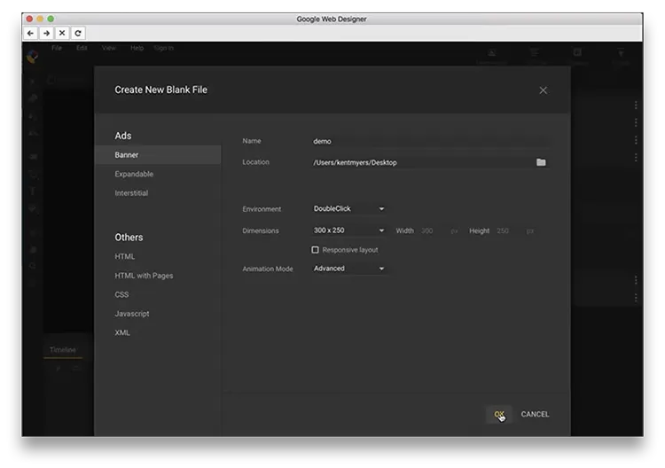
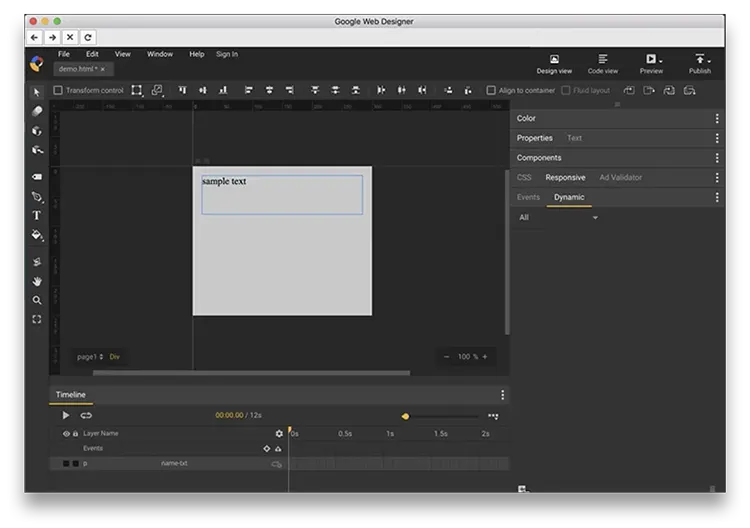
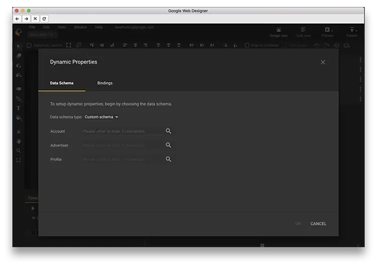
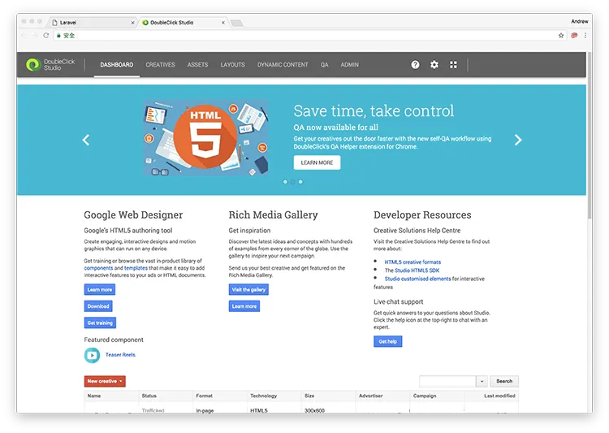
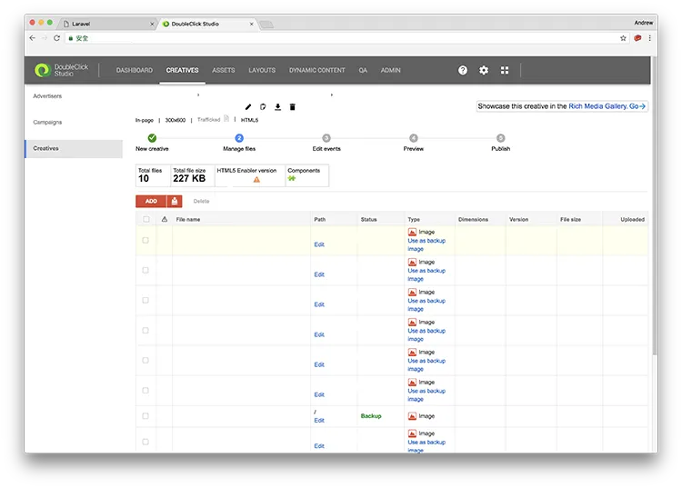

#### 以 DoubleClick Campaign Manager 的動態 targeting key filtering 建立廣告（第 2 部分）

> **更新：**DoubleClick 現已重新整合為 Google Marketing Platform。DoubleClick Campaign Manager 與 DoubleClick Studio 現在都歸屬於 Display & Video 360。詳情可參考[這篇文章](https://support.google.com/displayvideo/answer/9015629)與[這篇文章](https://www.blog.google/technology/ads/new-advertising-brands/)。

在[上一篇文章](https://medium.com/andrewmmc-io/import-dynamic-feed-to-advertiser-profile-in-doubleclick-studio-dbef1fa51384)中，我們談到如何把 dynamic feed 匯入 DoubleClick Studio 的 advertiser profile。這篇文章會繼續示範，如何利用上一個教學建立的 advertiser profile 來建立 creative。

### 3. 上傳與 advertiser profile 關聯的 creative

上一節產生的程式碼需要放進你的 creative 中，這樣動態內容才會被顯示出來。或者你也可以直接用 Google Web Designer 來設計 creative，並把 advertiser profile 關聯起來。

在 Google Web Designer 中建立新的空白檔案時，請把環境選擇為 **DoubleClick**。

建立空白檔案後，就可以開始設計了。若要匯入 advertiser profile 的動態內容，請點擊 **Events** 旁邊的 **Dynamic** 分頁，然後按底部的 **Add** 圖示。

第一次使用時，你需要先登入自己的 Google 帳戶。之後便可以從帳戶中選擇對應的 advertiser 與 profile。你會看到動態內容來源，並可能需要把它們與頁面元素連結起來。

完成後，只要按右上角的 **Publish** 圖示發佈 creative。然後回到 DoubleClick Studio，在導覽列按下 **Creatives** 分頁。

你應該就會在 Creatives 區塊看到剛上傳的 creative。你可以在這裡預覽橫幅，並送交 DoubleClick QA 審核。

[下一篇教學，我們會談談如何在 DoubleClick Campaign Manager 中管理動態廣告。](https://medium.com/andrewmmc-io/manage-ads-with-dynamic-targeting-key-in-doubleclick-campaign-manager-9a5d820d10d3)

---

#### 系列：以 DoubleClick Campaign Manager 的動態 targeting key filtering 建立廣告

[第 1 部分：將 dynamic feed 匯入 DoubleClick Studio 的 advertiser profile](https://medium.com/andrewmmc-io/import-dynamic-feed-to-advertiser-profile-in-doubleclick-studio-dbef1fa51384)
**第 2 部分：在 Google Web Designer 與 DoubleClick Studio 中建立動態素材**
[第 3 部分：在 DoubleClick Campaign Manager 中使用動態 targeting key 管理廣告](https://medium.com/andrewmmc-io/manage-ads-with-dynamic-targeting-key-in-doubleclick-campaign-manager-9a5d820d10d3)
