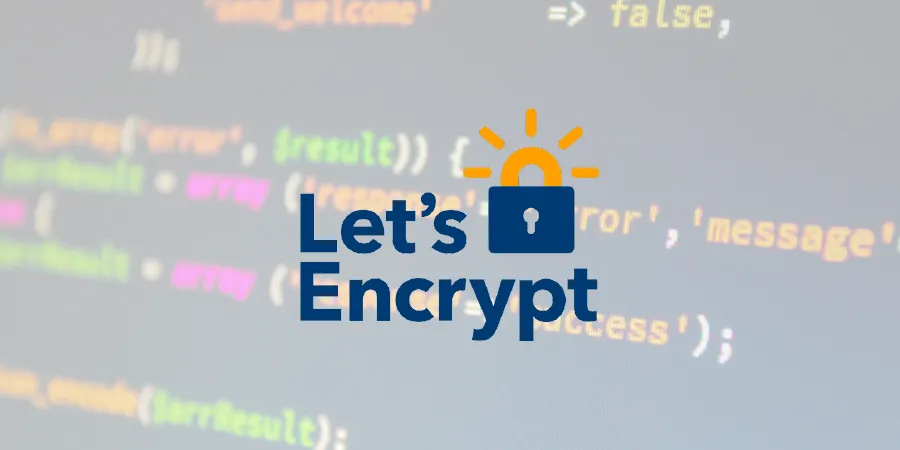
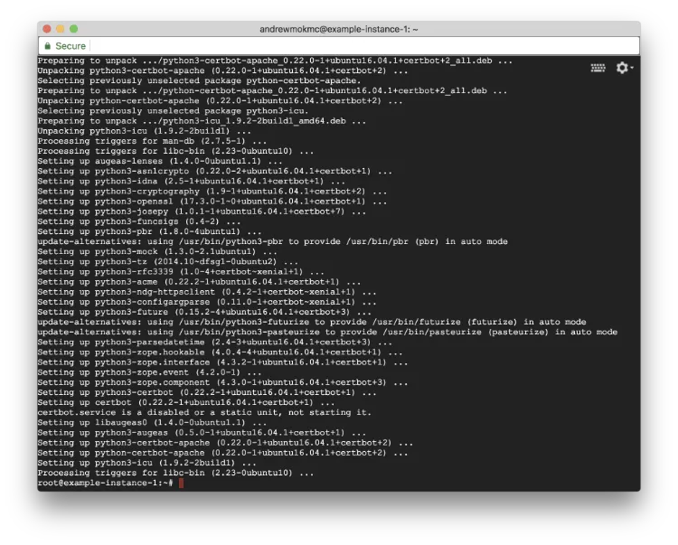
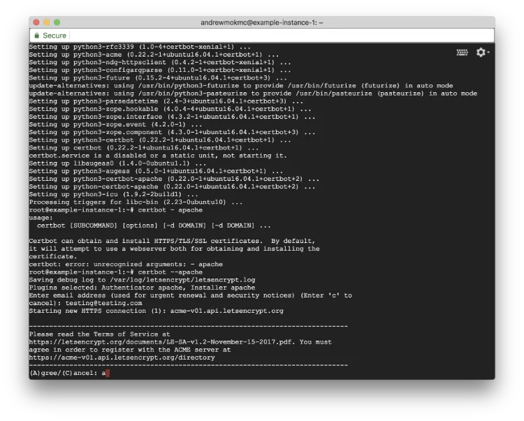
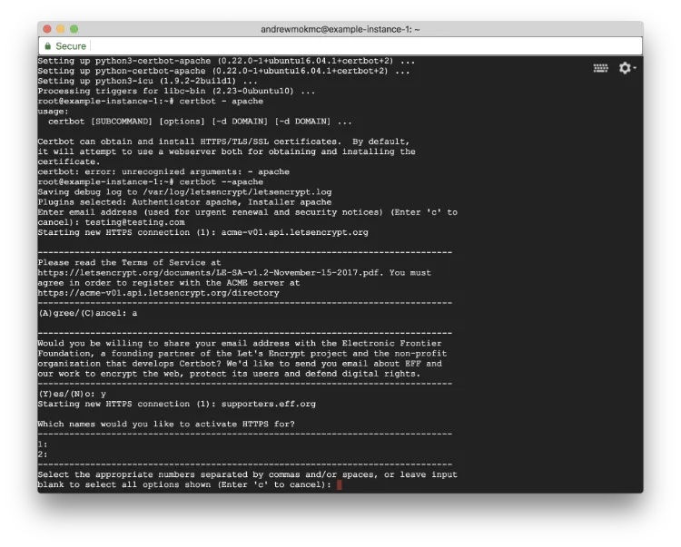

#### Setup Ubuntu 16.04 LEMP server with VestaCP on GCE (Part 4)

In the [previous article](/blog/upgrade-php-version-to-7-2-from-7-0/), we talked about how to upgrade PHP version to 7.2. In this article, we will continue to get free SSL certificates for our domains.



### 4. Get free SSL Certificates from Let's Encrypt for your domains

Let's Encrypt offers Domain Validation (DV) certificates for free. It is an open SSL certificate authority that maintained by Internet Security Research Group (ISRG).

Although an SSL cert signed by Let's Encrypt is only valid for 90 days, we can use an ACME agent `certbot` to help us to maintain the status of certs and renew them. In short, you can get wildcard certificates for your domains free.

If you are interested to know more about Let's Encrypt, please check this article: [How Let's Encrypt works](https://letsencrypt.org/how-it-works/).



As we're using Ubuntu 16.04 LTS with Apache in this tutorial, click [this link](https://certbot.eff.org/lets-encrypt/ubuntutyakkety-apache) or follow the instruction below to install `certbot` on our server.

```
$ apt-get update
$ apt-get install software-properties-common
$ add-apt-repository ppa:certbot/certbot
$ apt-get update
$ apt-get install python-certbot-apache
```



During the installation process, you may need to type your personal email and agree the terms. Simply type `a` to agree the Terms of Service.



All existing domains will be listed in the terminal window. Make sure that you have already updated the DNS records pointing to your server. Simply leave blank to select all domains to activate HTTPS.

After installed `certbot`, run the following command. It will get certificates for you and have `certbot` to edit your Apache configuration automatically.

```
$ certbot --apache
```

**Congratulations! **Your encrypt SSL certificates are ready. However, you still need to apply those certificates to your websites and Vesta control panel. [Check out our next post to apply certificates to your websites and force your websites in HTTPS connection.](/blog/apply-ssl-certificates-to-your-website-and-force-using-https-connections/)
