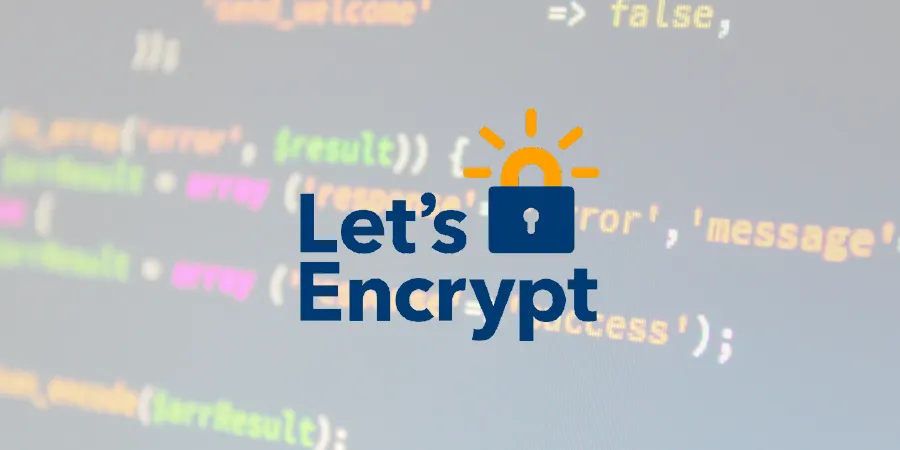
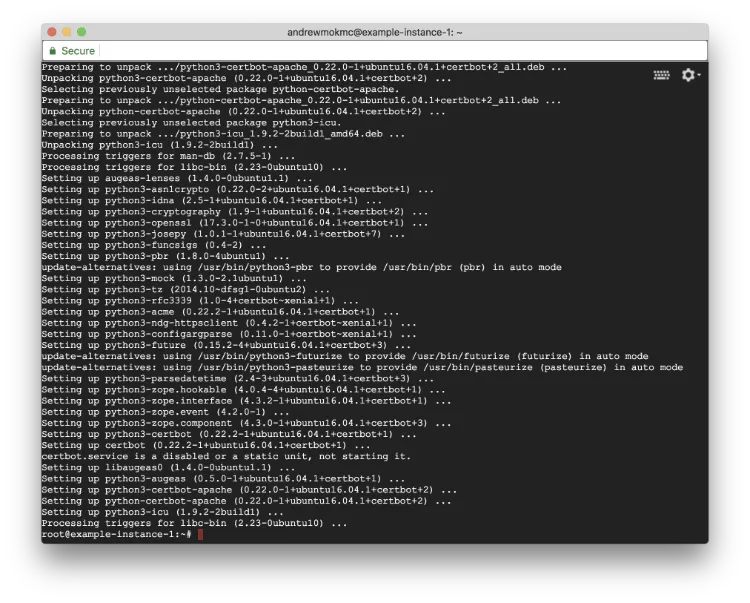
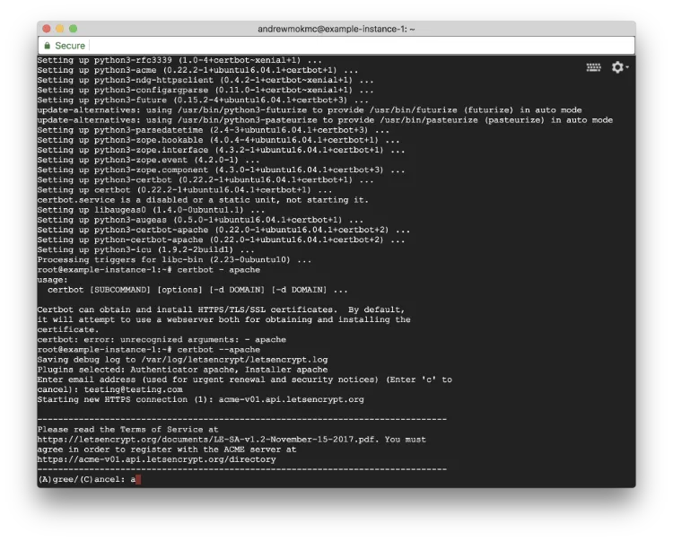
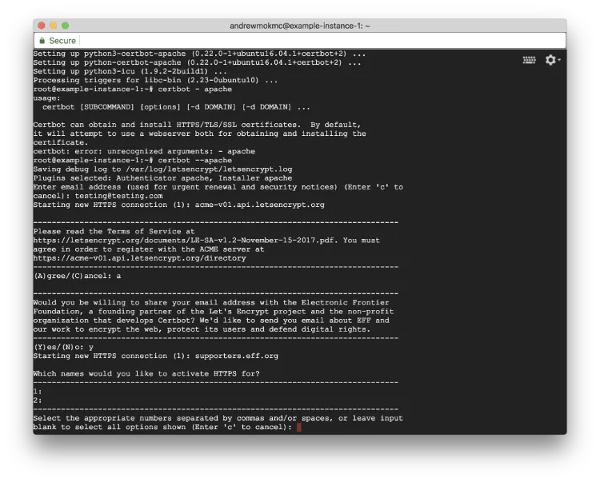

#### 在 GCE 上以 VestaCP 建立 Ubuntu 16.04 LEMP 伺服器（第 4 篇）

在[上一篇文章](/blog/upgrade-php-version-to-7-2-from-7-0/zh-hant/)中，我們談到如何把 PHP 版本升級到 7.2。這一篇會繼續說明如何為你的網域取得免費 SSL 憑證。



### 4. 為你的網域透過 Let's Encrypt 取得免費 SSL 憑證

Let's Encrypt 提供免費的網域驗證（DV）憑證。它是一個由 Internet Security Research Group（ISRG）維護的開放 SSL 憑證授權機構。

雖然 Let's Encrypt 簽發的 SSL 憑證只有 90 天有效期，但我們可以使用 ACME 用戶端 `certbot` 來協助管理與續期。換句話說，你可以免費為網域取得萬用字元憑證。

如果你想了解 Let's Encrypt 的運作方式，可以參考這篇文章：[How Let's Encrypt works](https://letsencrypt.org/how-it-works/)。



由於這篇教學使用的是 Ubuntu 16.04 LTS 搭配 Apache，請點擊[這個連結](https://certbot.eff.org/lets-encrypt/ubuntutyakkety-apache)或依照以下步驟在伺服器上安裝 `certbot`。

```
$ apt-get update
$ apt-get install software-properties-common
$ add-apt-repository ppa:certbot/certbot
$ apt-get update
$ apt-get install python-certbot-apache
```



在安裝過程中，你可能需要輸入個人電郵並同意相關條款。只需要輸入 `a` 以同意服務條款即可。



終端機中會列出所有現有網域。請先確認這些網域的 DNS 記錄已經正確指向你的伺服器。若直接留空，便會選取所有網域並啟用 HTTPS。

完成 `certbot` 安裝後，執行以下指令。它會為你取得憑證，並讓 `certbot` 自動調整 Apache 設定。

```
$ certbot --apache
```

**完成了！** 你的 Let's Encrypt SSL 憑證已經準備好。不過，你仍然需要把這些憑證套用到網站與 Vesta 控制台。[下一篇文章會說明如何把憑證套用到網站，並強制網站使用 HTTPS。](/blog/apply-ssl-certificates-to-your-website-and-force-using-https-connections/zh-hant/)
