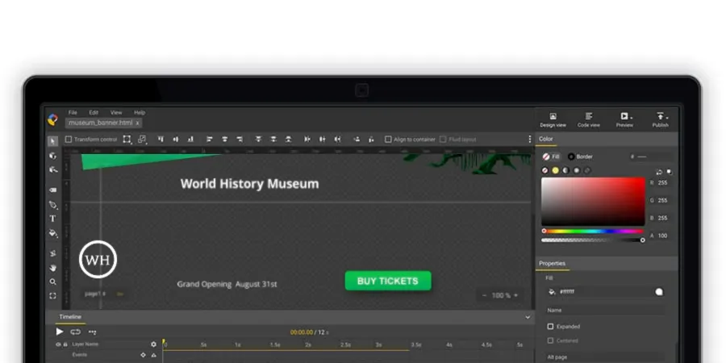

Firefox have some problems in rendering the `preserve-3d` transform-style elements. So when we create an banner tap area in Google Web Designer, it become non-clickable in Firefox.

To solve it, you may:

1. Go to the Code View in Google Web Designer.
2. Look for this CSS class in the code: `.gwd-page-content`.
3. Set the `transform-style` as `flat`.
4. Republish the creative.

---

References:

- [taparea/clicklayer disappearing in Firefox browser](https://groups.google.com/forum/#!msg/gwdbeta/OAHXRwS7sbM/7omnaQ6yPgAJ)
