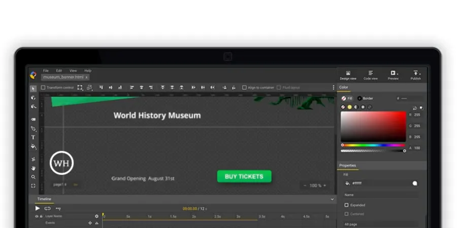

Firefox 在渲染 `preserve-3d` 的 transform-style 元素時會出現一些問題。所以當我們在 Google Web Designer 建立 banner 的 tap area 時，它在 Firefox 裡就可能變成無法點擊。

要解決這個問題，你可以：

1. 在 Google Web Designer 切換到 Code View。
2. 在程式碼中找出這個 CSS class：`.gwd-page-content`。
3. 將 `transform-style` 設為 `flat`。
4. 重新發佈這個 creative。

---

參考資料：

- [taparea/clicklayer disappearing in Firefox browser](https://groups.google.com/forum/#!msg/gwdbeta/OAHXRwS7sbM/7omnaQ6yPgAJ)
