#### 在 DoubleClick Campaign Manager 中以 dynamic targeting key 建立廣告（第 1 部分）

> **更新：** DoubleClick 現已重新命名為 Google Marketing Platform。DoubleClick Campaign Manager 與 DoubleClick Studio 現已整合至 Display & Video 360 產品之下。詳情可參考[這篇文章](https://support.google.com/displayvideo/answer/9015629)及[這篇文章](https://www.blog.google/technology/ads/new-advertising-brands/)。

DoubleClick Campaign Manager 是一套供廣告主使用的廣告管理系統，提供多種工具來管理 creative 並投放廣告活動。

在這個教學系列中，我們會一步一步示範如何在 DoubleClick Campaign Manager 與 DoubleClick Studio 中，建立帶有 dynamic targeting key 篩選功能的廣告。

### 1. 建立 dynamic feed

Dynamic feed 通常會包含不同的標題、網址與內容，供 creatives 動態載入使用。你可以參考[這份指南](https://support.google.com/richmedia/answer/3399836)為 advertiser 建立 dynamic feed，而 sample spreadsheet 則可在[這裡](https://docs.google.com/spreadsheets/d/15fz1Yi4bfxJ1k-b7yTxBsDWSS4nVppNCEhxHpANtGNI/edit#gid=0)找到。

Feed list 內的內容，會依據合適的 targeting key 顯示在對應的 ad placement creative 中。為了把 ad placement 與 advertiser profile 的 key 對應起來，我們會在試算表中加入一欄叫做 `Keywords`。請為每一列內容填入對應 target 的值，而這個值必須和稍後加入到 ad placement 的值一致。如果你想對應多個 key，可以用逗號分隔。

### 2. 把 dynamic feed 上傳到 advertiser profile

如果你的 dynamic feed 已經準備好，接下來就是把它上傳到 advertiser profile！

打開 DoubleClick Studio，然後在導覽列中按下 Dynamic Content。

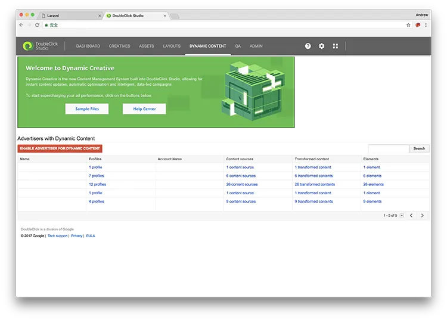

按下 Enable Advertiser for dynamic content，然後在下一頁選擇你的帳戶與對應 advertiser。

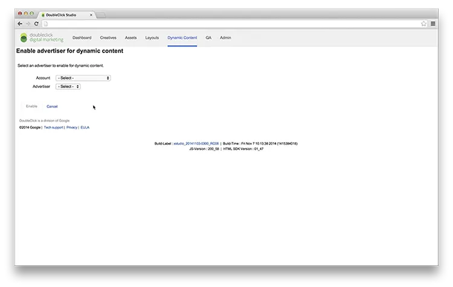

啟用之後，你就可以建立新的 advertiser profile。按下 **New profile** 按鈕，並填寫必要欄位，例如 Profile name。

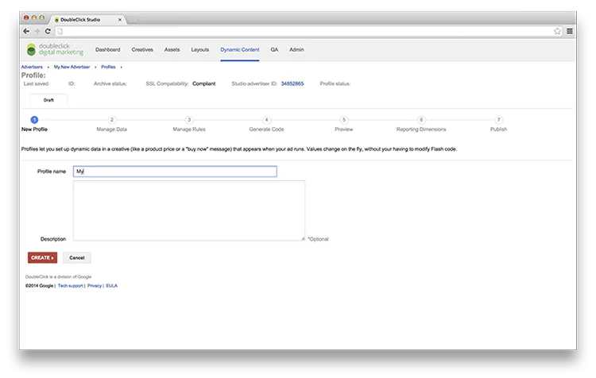

之後，你可以在 Manage Data 區塊中的 Feeds 上傳剛才建立的 feed。按下 **New Content** 按鈕，把 feed 匯入到這個 profile。

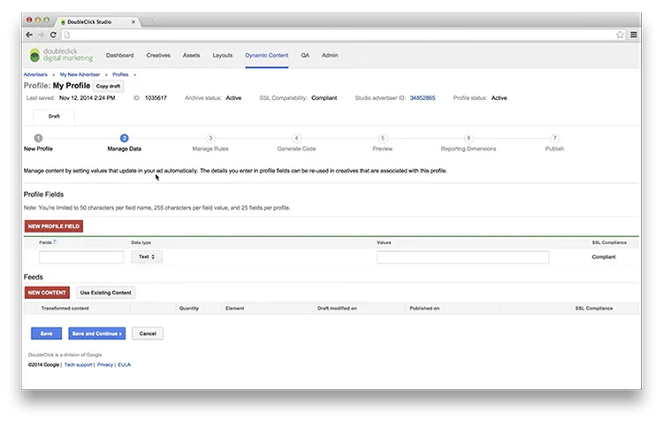

在轉換檔案之前，請先確認你已經把 spreadsheet 分享給以下兩個 email 帳戶：`studiodynamiccreative@system.gserviceaccount.com` 與 `studio-dynamic-creatives@google.com`。

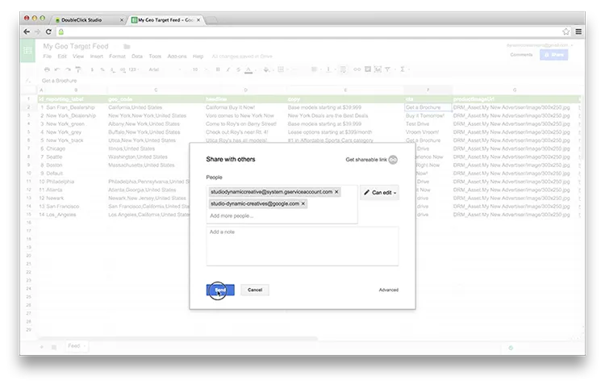

你可以從 Google Docs 選擇內容來源並上傳剛建立的 dynamic feed list，然後按下 **Start Import**。

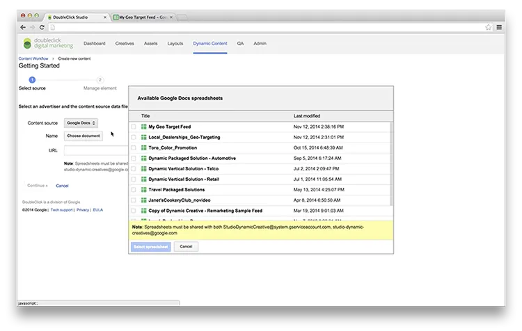

如果 preview 區塊顯示的資料正確，在按下 **Continue** 之前，請記得為 ID 與 Reporting label 選擇合適的 data field，並為各欄位設定正確的資料型別。

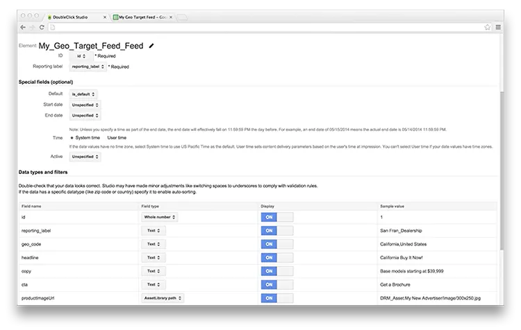

當資料成功轉換後，你應該會在 Feed 欄位看到匯入的內容。按下 **Save and Continue**。之後你可以為不同 feed 設定 rules。通常我們可以保留預設設定，例如 **Auto-filter** 類型與 **Optimised** Rotation，除非你對 ad rotation 有其他偏好。

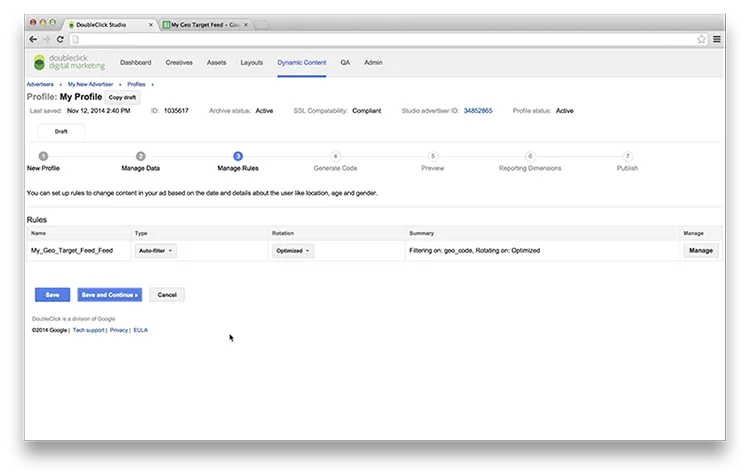

之後，你便會看到系統為廣告產生的 code。下一節會說明這段 code 的用途。

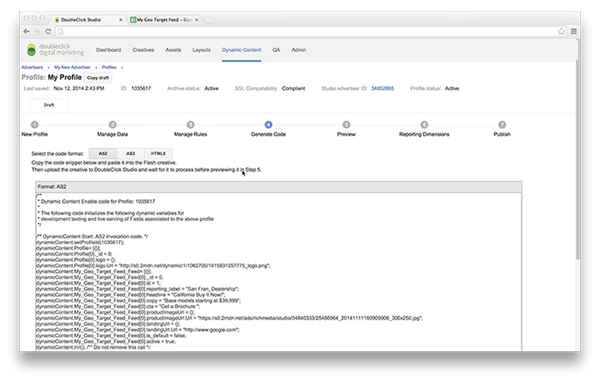

然後你可以依照匯入的欄位，為這個 profile 選擇 reporting dimensions。

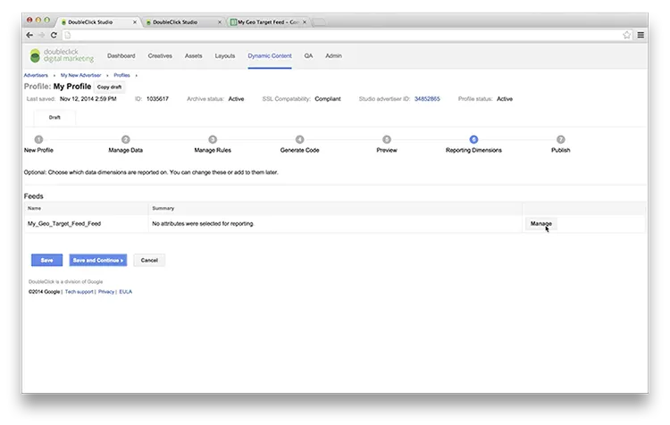

很好！最後把 advertiser profile 發佈成 active 狀態，這樣你就可以開始在 creatives 中使用它。

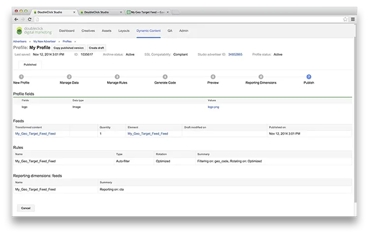

**恭喜！** 你的 advertiser profile 現在已可用於提供 dynamic creatives。[接著可以閱讀下一篇文章，了解如何在 Google Web Designer 建立廣告。](https://medium.com/andrewmmc-io/create-dynamic-creatives-in-google-web-designer-with-doubleclick-studio-da47141026e)

---

#### 系列：在 DoubleClick Campaign Manager 中以 dynamic targeting key 建立廣告

**第 1 部分：在 DoubleClick Studio 中匯入動態資料饋送至 advertiser profile**
[第 2 部分：在 Google Web Designer 中使用 DoubleClick Studio 建立動態 creative](https://medium.com/andrewmmc-io/create-dynamic-creatives-in-google-web-designer-with-doubleclick-studio-da47141026e)
[第 3 部分：在 DoubleClick Campaign Manager 中以 dynamic targeting key 管理廣告](https://medium.com/andrewmmc-io/manage-ads-with-dynamic-targeting-key-in-doubleclick-campaign-manager-9a5d820d10d3)
