#### 在 GCE 上使用 VestaCP 架設 Ubuntu 16.04 LEMP 伺服器（第 2 部分）

在[上一篇文章](/blog/setup-vm-instance-on-google-cloud-compute-engine/zh-hant/)，我們談到如何在 Google Cloud 上為網站伺服器建立 VM instance。這篇文章會接續示範，如何在剛建立的 VM instance 上安裝具備 LEMP 的 VestaCP。

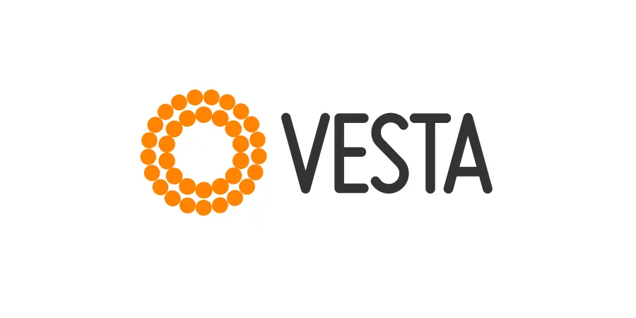

### 2. 在 VM instance 上安裝具備 LEMP 的 VestaCP

**（1）透過 SSH 連線進入 instance**

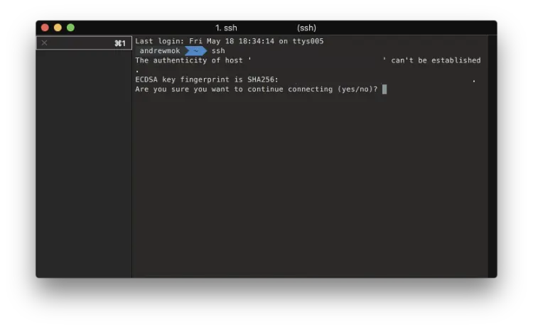

首先，在你的電腦打開終端機並透過 SSH 連線到伺服器。記得不要直接使用 root 帳號加密碼登入。

```
$ ssh <USERNAME>@<SERVER_IP>
```

第一次連線時，你可能會看到主機真偽的警告訊息。輸入 `yes` 繼續即可。成功登入後，你會看到類似下面的畫面：

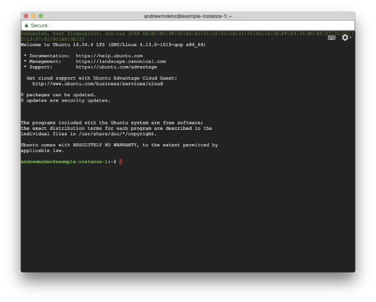

接著在終端機輸入以下指令切換到 root 帳號：

```
$ sudo su -
```

在下載 VestaCP 之前，建議先更新伺服器上已安裝的套件。

```
$ apt-get update
$ apt-get upgrade -y --force-yes
```

**（2）下載 VestaCP 安裝腳本並安裝到伺服器**

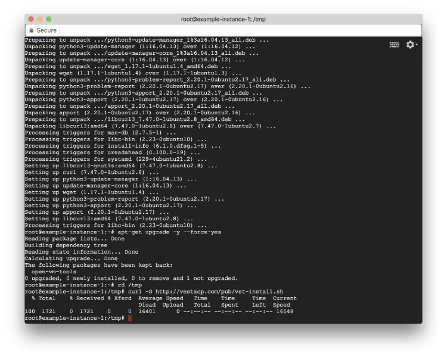

執行完上述指令後，再輸入以下指令把 VestaCP 的安裝腳本下載到伺服器：

```
$ cd /tmp
$ curl -O http://vestacp.com/pub/vst-install.sh
```

如果你想自訂安裝內容，可以參考 [VestaCP 官方安裝頁面](http://vestacp.com/install/) 提供的建議指令；如果想使用預設模組，直接執行下面的指令即可：

```
$ bash vst-install.sh
```

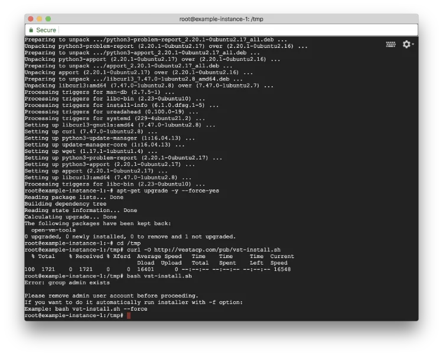

如果你看到提示 admin user group 已存在的錯誤訊息，只要在指令後加上 `-f` 再執行一次即可。

之後你會看到安裝畫面，列出即將安裝的軟體。

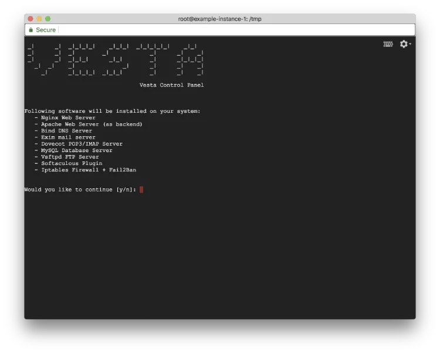

輸入 `y` 繼續安裝流程。

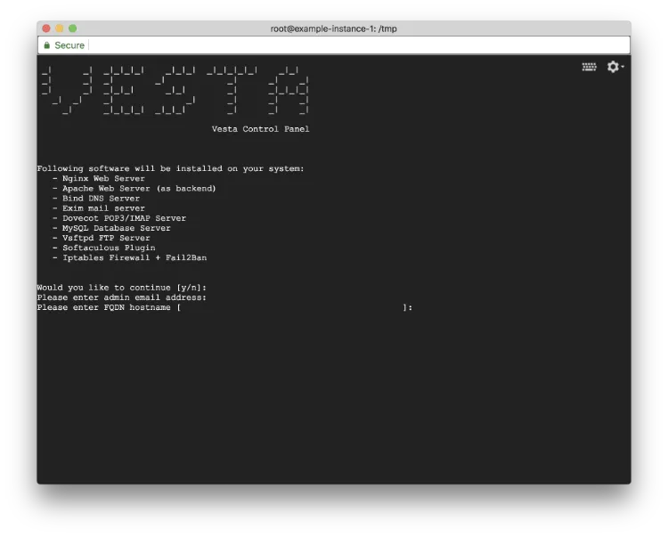

安裝期間還需要輸入你的電子郵件地址與主機名稱（也就是你的網域名稱）。整個安裝過程可能需要數分鐘。

**（3）把 TCP/8083 對外開放給 VestaCP 使用**

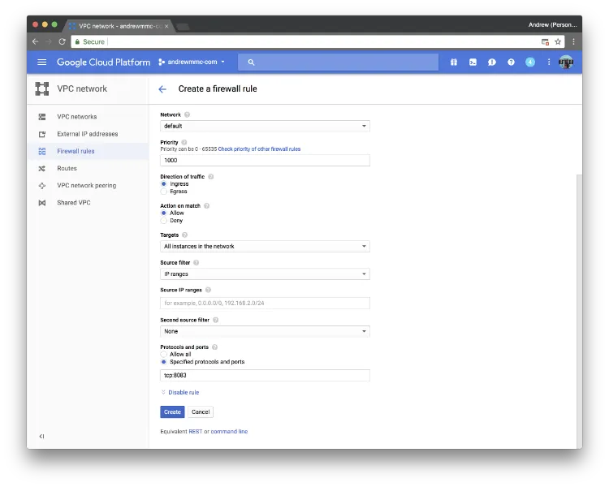

在進入安裝好的控制面板之前，需要先在防火牆規則中把 8083 port 對外開放，因為 VestaCP 會使用 8083 port。前往 `VPC network` > `Firewall rules`，然後點選 `Create firewall rule`。

規則名稱可以填入 `vestacp`，Target tags 則填上 `http-network` 和 `https-network`（你應該可以在 VM 詳細資訊中看到相關 tag）。

如果你不確定正確的 tag 名稱，也可以直接選擇 `All instances in the network`。在 Protocols and ports 內填入 `tcp:8083`，把 8083 port 對外開放。

完成後按下 `Create`，等待幾秒鐘即可。

**（4）記下你的 admin 使用者名稱與密碼**

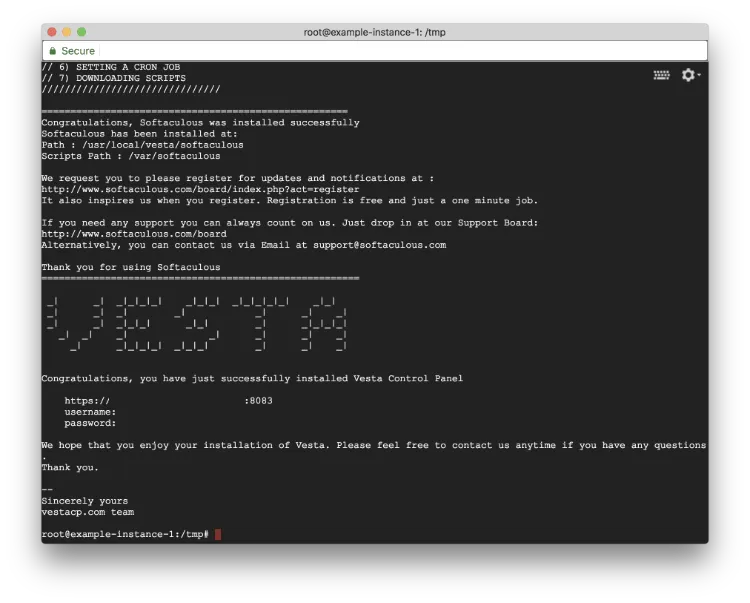

安裝完成後，終端機會顯示成功訊息。記得把 admin 使用者名稱與密碼記下來。

之後開啟終端機畫面上顯示的控制台網址即可進入面板。（別忘了先把你的網域 DNS 記錄更新好！）

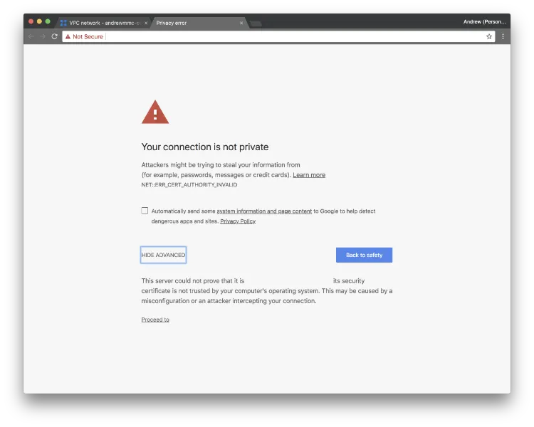

在正式進入控制台前，你可能會先看到下面這個畫面。別擔心，我們稍後會處理它，先直接點選 `Proceed to` 即可。

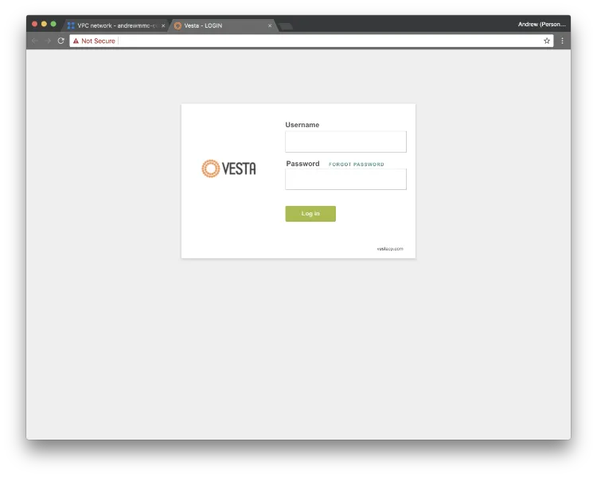

**恭喜！** VestaCP 已經準備好了。[接著閱讀下一篇文章，安裝網站需要的 PHP 7.2。](/blog/upgrade-php-version-to-7-2-from-7-0/zh-hant/)
