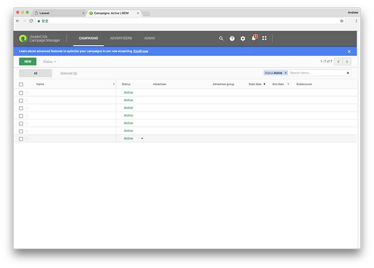
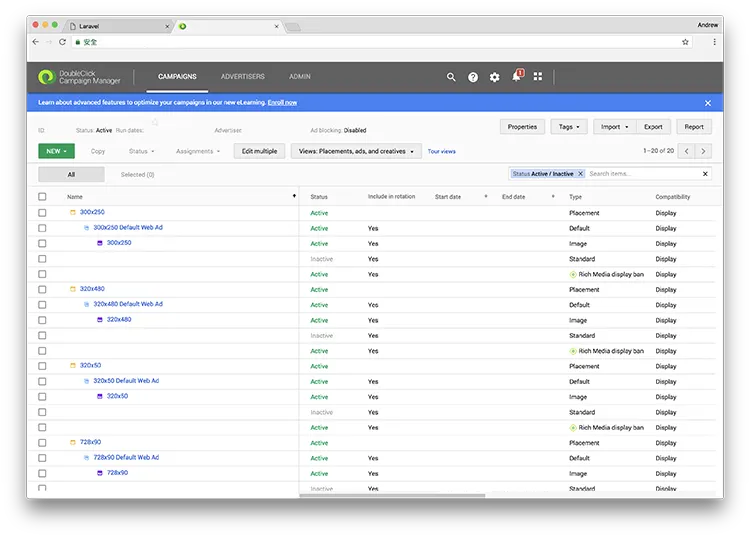
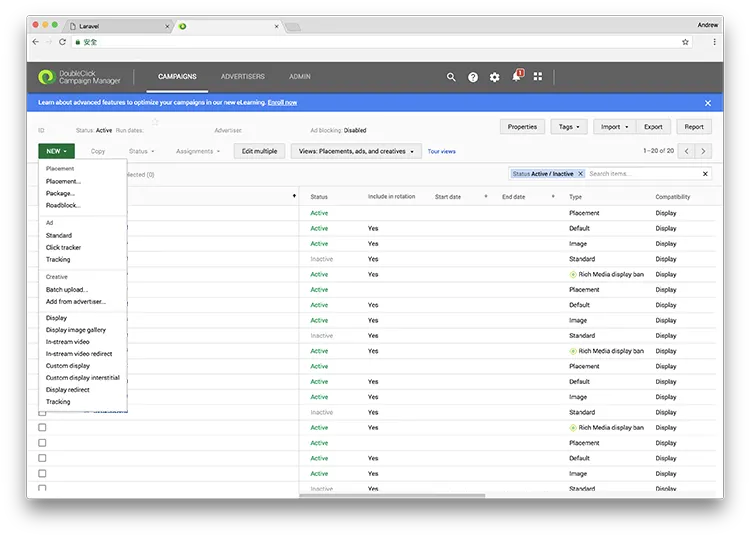
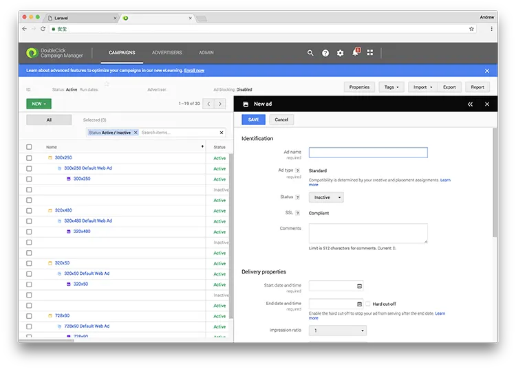
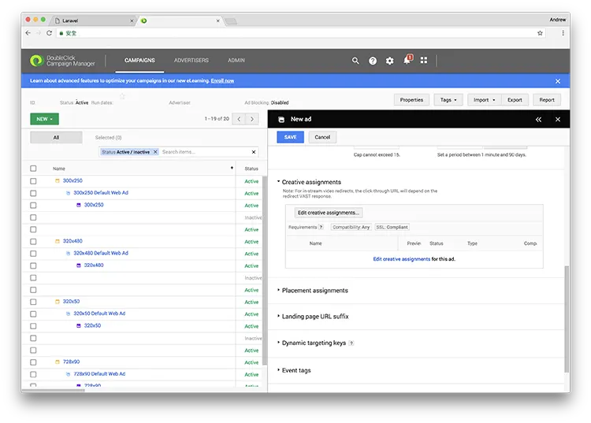
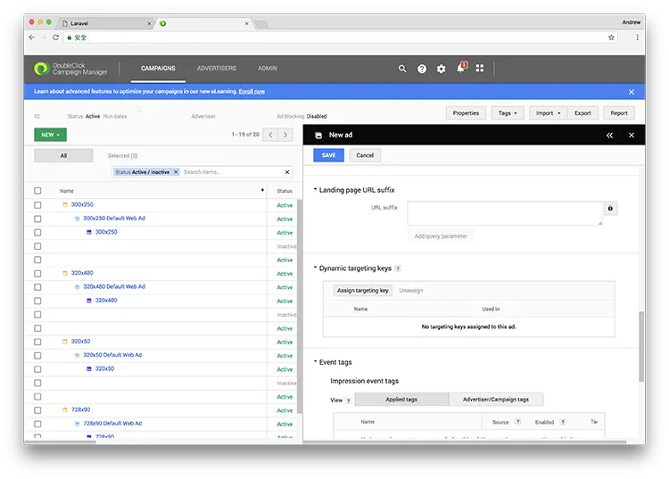
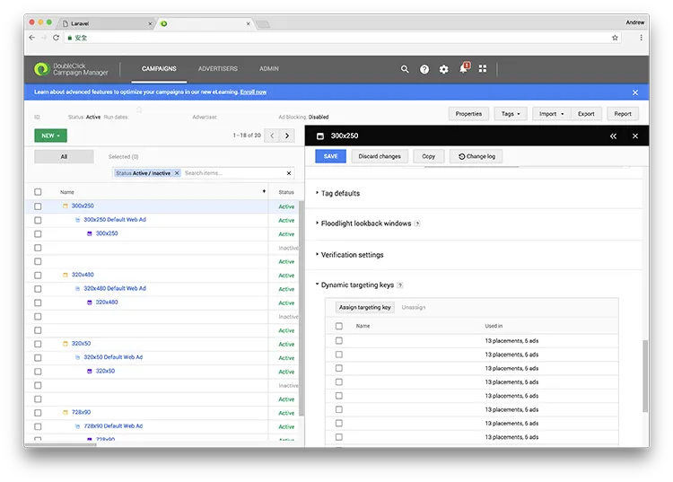

#### 在 DoubleClick Campaign Manager 以 dynamic targeting key filter 建立廣告（第 3 部分）

> **更新：**DoubleClick 現已重新命名為 Google Marketing Platform。DoubleClick Campaign Manager 與 DoubleClick Studio 現在都整合到名為 Display & Video 360 的產品中。詳情可參考[這篇文章](https://support.google.com/displayvideo/answer/9015629)與[這篇文章](https://www.blog.google/technology/ads/new-advertising-brands/)。

在[上一篇文章](https://medium.com/andrewmmc-io/create-dynamic-creatives-in-google-web-designer-with-doubleclick-studio-da47141026e)中，我們介紹了如何把已關聯 advertiser profile 的 creative 上傳到 DoubleClick Studio。這一篇會說明如何在 DoubleClick Campaign Manager 使用 dynamic targeting key 管理廣告。

### 4. 建立新 campaign

你可以在 DoubleClick Campaign Manager 中管理廣告與 campaigns。先進入 **Campaigns** 區塊，選擇你想繼續處理的 campaign。如果你之前還沒有建立過 campaign，也可以按 **New** 來建立新的 campaign。

你可以在這裡看到這個 campaign 內所有 ad placement 以及相關的 ads。

按下 **New**，再選擇 **Ad Standard** 來新增一個 ad。如果你先前還沒有建立 ad placement，系統也會自動為這個新 ad 建立一個新的 ad placement。

接著你會在右下角看到一個新視窗。你需要先為這個 ad 填寫一個識別名稱，並設定其他屬性，例如投放期間與 impression ratio（相對於同一 ad placement 內其他 ads 的比例）。

你至少需要為這個 ad 指派一個 creative。按下 **Edit creative assignments**，然後選擇你在上一篇教學中上傳到 DoubleClick Studio 的 dynamic creative。

完成後，你還需要為這個 ad 或 ad placement 設定 dynamic targeting keys。按 **Assign targeting key**，然後新增你希望與這個 ad 關聯的 targeting key。

之後再完成其餘設定，例如 event tags，最後按下 **Save** 儲存即可！

你可以為不同的 ads 與 ad placements 重複以上步驟。當一切就緒後，便可以按 **Tags** 產生 HTML tags 程式碼，提供給 publishers 放到網站或系統內。

---

#### 系列：在 DoubleClick Campaign Manager 以 dynamic targeting key filter 建立廣告

[第 1 部分：在 DoubleClick Studio 匯入 dynamic feed 到 advertiser profile](https://medium.com/andrewmmc-io/import-dynamic-feed-to-advertiser-profile-in-doubleclick-studio-dbef1fa51384)
[第 2 部分：在 Google Web Designer 與 DoubleClick Studio 建立 dynamic creatives](https://medium.com/andrewmmc-io/create-dynamic-creatives-in-google-web-designer-with-doubleclick-studio-da47141026e)
**第 3 部分：在 DoubleClick Campaign Manager 以 dynamic targeting key 管理廣告**
