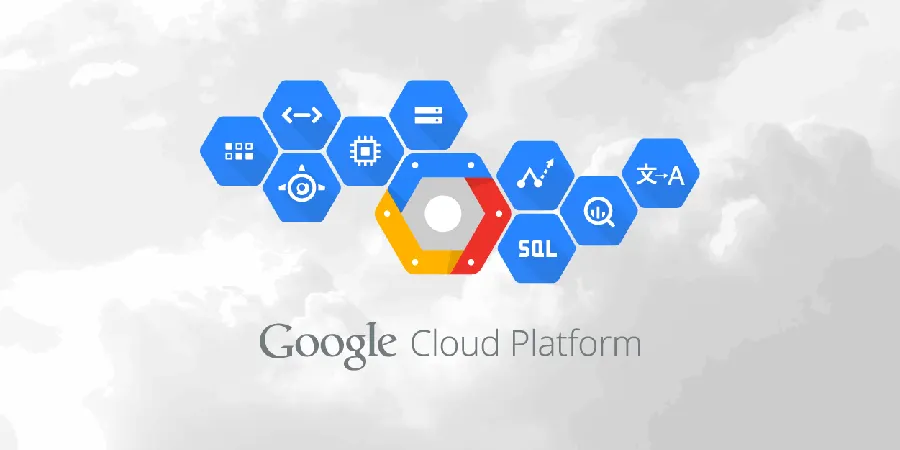
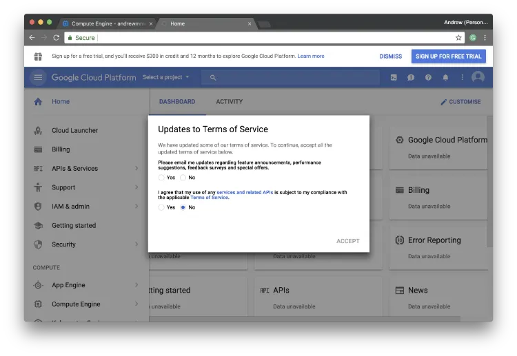
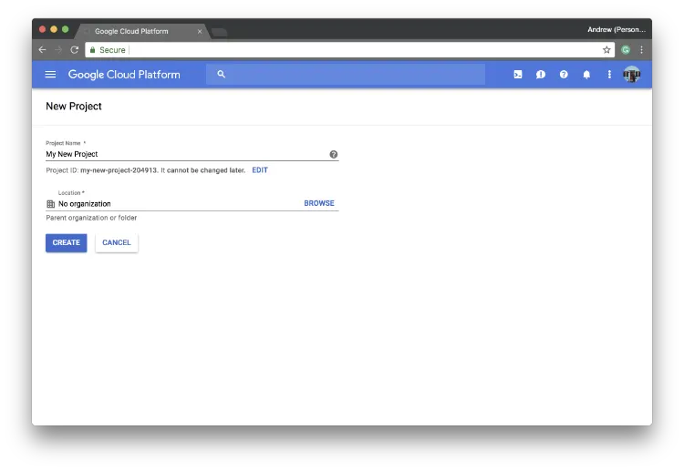
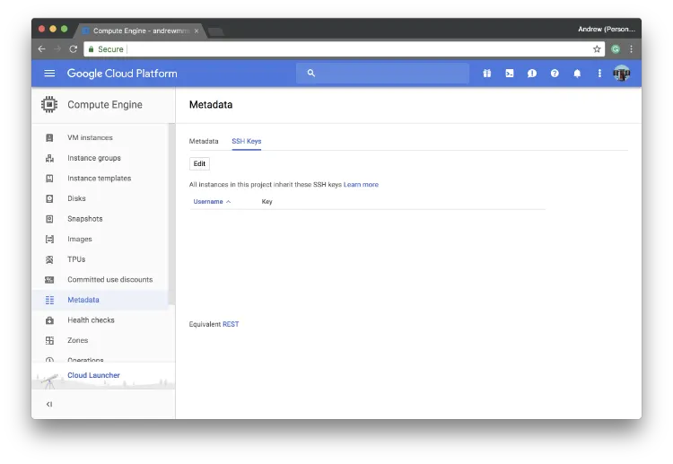
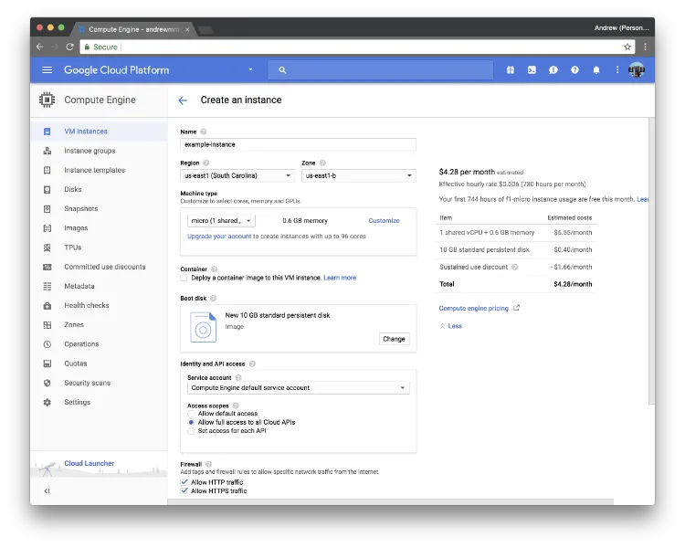
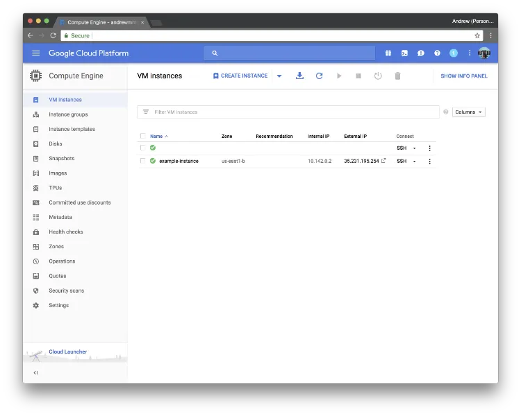
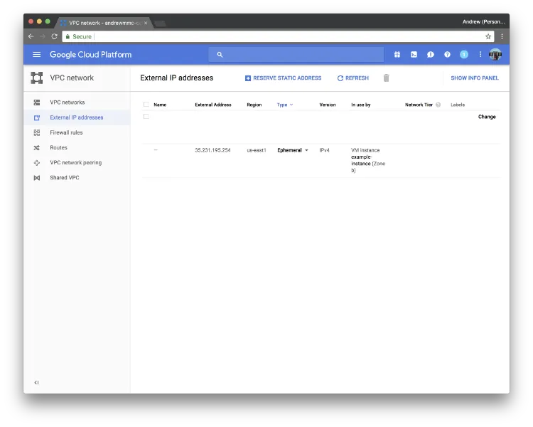
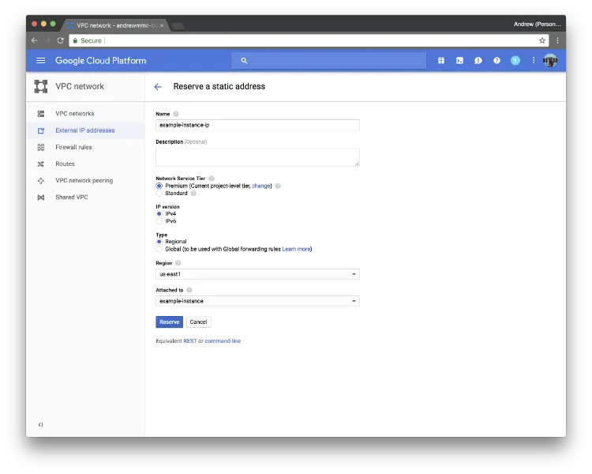

#### 在 GCE 上以 VestaCP 建立 Ubuntu 16.04 LEMP 伺服器（第 1 篇）



Vesta Control Panel 是一套免費而且開源、搭配 LEMP stack 的控制面板。
它提供網站、電郵、資料庫、DNS 等不同功能。

在這個系列中，我們會在 Google Cloud Compute Engine 上建立一台具備完整網站功能的伺服器。完成後，你會有一台安裝了 Vesta、PHP 7.2 與 MySQL 5.6 的 Ubuntu 16.04 伺服器。

### 先決條件

- 一個可自行修改 DNS 紀錄的已註冊網域
- 一組在自己電腦產生的 SSH key
- 一個 Google 帳戶（如果你會使用 Google Cloud）

### 1. 在 Google Cloud Compute Engine 上建立 VM instance

我們會在 Google Cloud 上建立網站伺服器用的 VM instance。市面上也有其他提供類似服務的供應商，例如 Amazon EC2、DigitalOcean droplet，你可以比較不同方案後選擇適合自己的。

Google Compute Engine（GCE）每月會提供免費額度，讓你在北美地區執行一台 f1-micro VM instance，並附帶 30GB HDD 與 1GB 網路流量（不包括澳洲與中國大陸）。

當然，你也可以按自己的預算與預期流量選擇更合適的機器。計費模式可按[這裡](https://cloud.google.com/compute/pricing)查看。基本上，對於低流量個人網站來說已經夠用。

**(1) 註冊 Google Cloud Platform**

你可以使用自己的 Google 帳戶登入 [Google Cloud](https://cloud.google.com/)，然後按 `Go to console`。



你會看到 Google 提供 12 個月 US$300 試用額度的訊息。按下 `Sign Up For Free Trial`，並填寫一些基本個人資料。

**(2) 建立新專案並加入 SSH 公鑰**



之後，你應先建立一個新 project。建議把自己的 SSH 公鑰加入 project，以避免直接用 root 帳戶登入伺服器。



前往 `Compute Engine`，切換到 `Metadata` 分頁，再按 `SSH Key`。按下 `Edit` 後，你便可以貼上自己的 SSH 公鑰。一般來說，你的 SSH key 會存放在 `~/.ssh`。在電腦打開終端機並輸入以下指令：

```
$ cd ~/.ssh
$ ls
```

你會看到私鑰與公鑰都已儲存在電腦內。如果你還未產生 SSH key，可參考[這裡](https://help.github.com/articles/generating-a-new-ssh-key-and-adding-it-to-the-ssh-agent/#generating-a-new-ssh-key)了解如何建立。一般檔名會是 `id_rsa`（私鑰）與 `id_rsa.pub`（公鑰）。然後在終端機輸入：

```
$ cat id_rsa.pub
```

把顯示出的公鑰複製起來並貼到頁面的輸入欄中，再按 `Save` 儲存。SSH key 左邊顯示的部分就是**你的使用者名稱**，之後可用來登入伺服器。

**(3) 建立新的 VM instance**

接著切換到 `VM instances` 分頁，然後按 `Create VM instance`。



選擇適合你的機器類型與 boot disk。在這篇教學中，我們會選擇美國區的 `f1-micro`，搭配 10GB SSD，OS image 則使用 **Ubuntu 16.04 LTS**。建議同時允許所有 Cloud APIs 存取，以及 HTTP/HTTPS 流量。



填好所需資料後，按下 `Create` 建立新的 VM。稍等片刻後，你便會在控制台看到新建立的 VM instance。

**(4) 為 instance 保留靜態 IP 位址**



在登入機器前，先前往 `VPC network` 與 `External IP address`。你會看到 instance 正在使用 ephemeral IP。按下 `Reserve a static address`，替你的新機器保留一個靜態 IP 位址。



完成後，你應該會看到一個新的 IP 位址已保留給該 instance。你可以把個人網域的 DNS A 紀錄指向這個新 IP 位址。

**恭喜！** 你的機器已準備好安裝 VestaCP。[下一篇我們會繼續介紹如何安裝它。](/blog/install-vestacp-with-lemp-on-your-vm-instance/zh-hant/)
