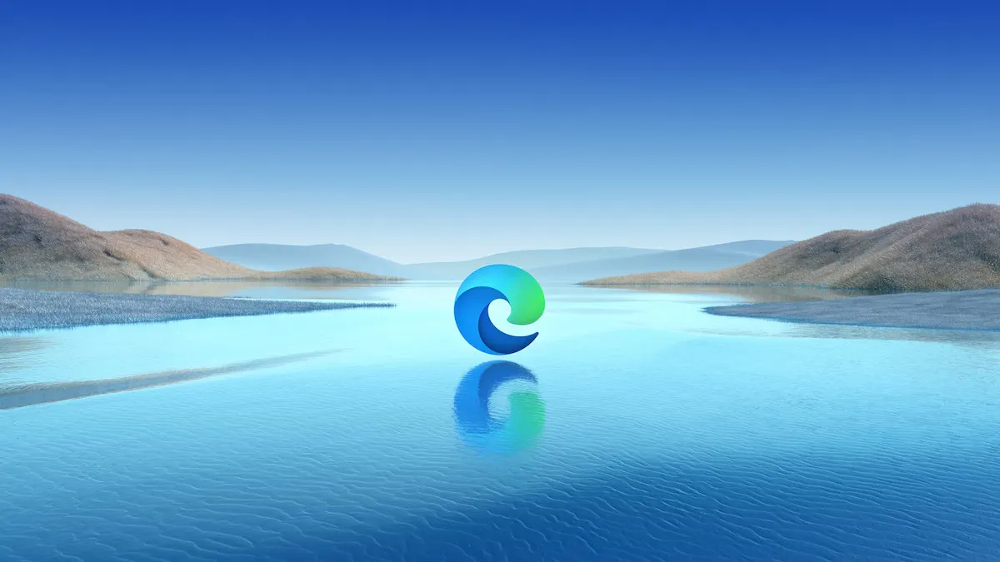
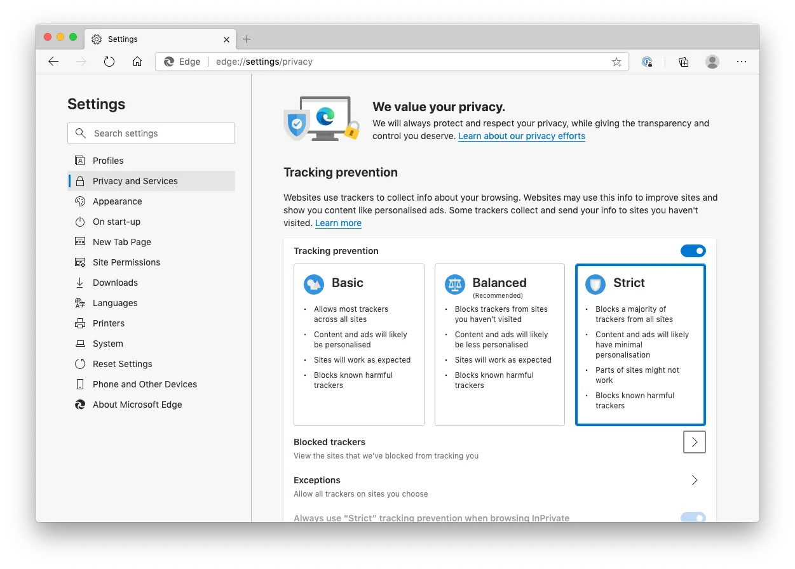
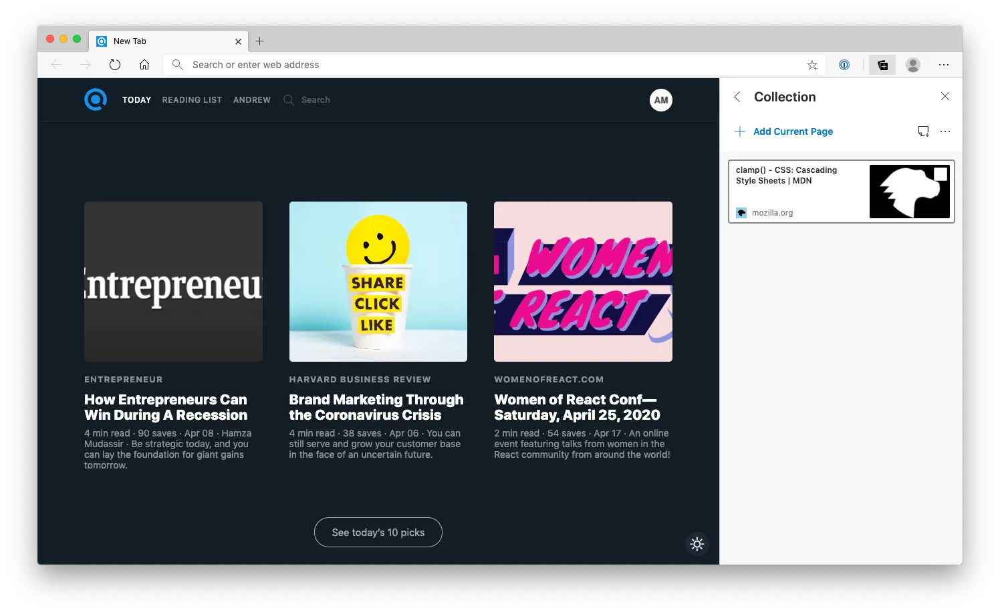

Microsoft announced to replace Edge rendering engine from EdgeHTML to Chromium last year and released the new Microsoft Edge on January this year. It bases on the Chromium open-source project. I gave them a try, and it’s so impressive that Microsoft team did a great job on that. You may have some bad experiences using Internet Explorer or old Edge browser, but I think it’s a great time to check again. Here are some reasons:

### More strict privacy control

Comparing to Google Chrome collecting your data for their analysis, the new Edge provides a more strict tracking preventing option, for detecting and blocking known trackers for collecting data.

### Collection

Collection is a nice feature that I love the most! It helps to collect and organise the web pages and snippets that are going to read later.

Although Edge and Chrome are very similar now as they base on the same open-source project, there are some other impressive features offered by Microsoft, for example:

- Account sync with Microsoft account
- 100% Support on HTML5 features
- Immersive Reader
- Compatible with Chrome extension

If you don’t want Google to keep tracking your data, but you still want the sync feature offered, Edge would be the best fit for you. The new Edge browser is now available on Mac, Windows, iOS and Android devices. [You can download it here.](https://www.microsoft.com/en-us/edge)
