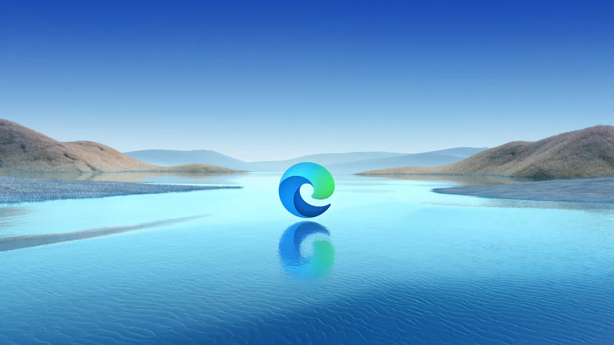
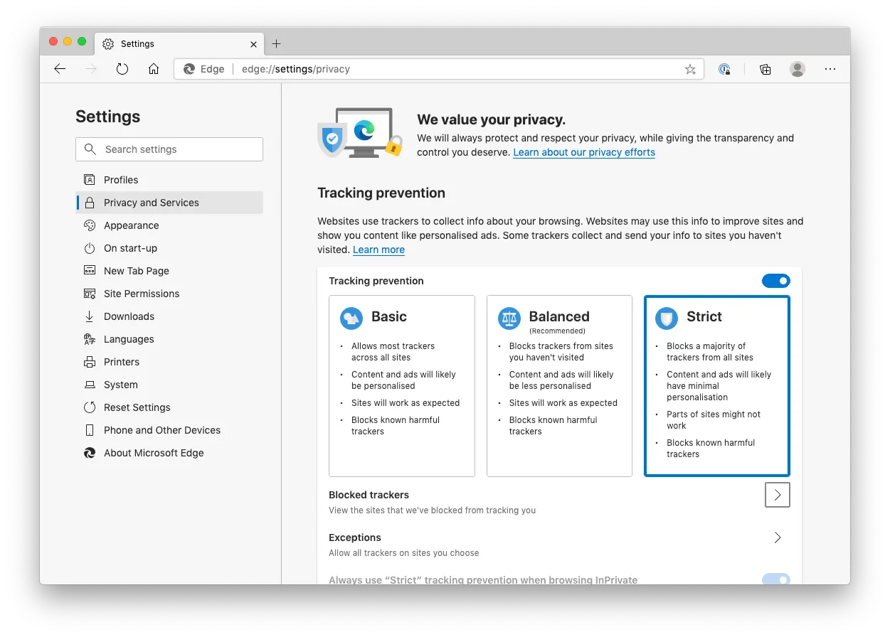
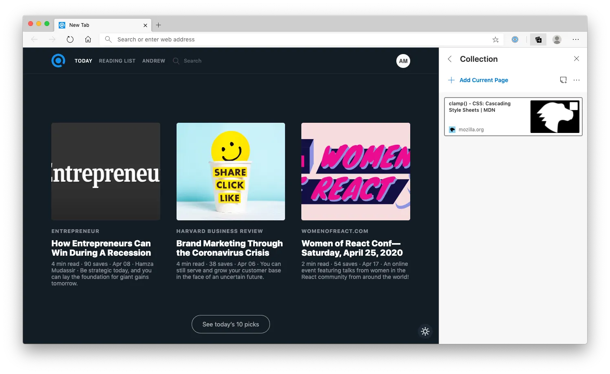

Microsoft 去年宣布把 Edge 的渲染引擎從 EdgeHTML 換成 Chromium，並在今年一月推出了全新的 Microsoft Edge。它是基於 Chromium 開源專案而建立。我試用了之後覺得非常驚喜，Microsoft 團隊真的做得很好。也許你過去對 Internet Explorer 或舊版 Edge 有不太好的印象，但我認為現在正是重新認識它的好時機。以下是幾個原因：

### 更嚴格的私隱控制

相比 Google Chrome 會收集你的資料作分析，新版 Edge 提供了更嚴格的追蹤防護功能，可偵測並封鎖已知追蹤器，避免它們收集你的資料。

### 集錦 Collections

Collections 是我最喜歡的功能之一！它可以幫助你整理之後要閱讀的網頁與摘錄內容。

雖然 Edge 與 Chrome 現在因為同樣建基於 Chromium 專案而變得非常相似，但 Microsoft 仍然提供了一些相當出色的功能，例如：

- 與 Microsoft 帳戶同步
- 100% 支援 HTML5 功能
- 沉浸式閱讀器（Immersive Reader）
- 相容 Chrome 擴充功能

如果你不想繼續讓 Google 追蹤你的資料，但仍然希望保有同步功能，那麼 Edge 會是很合適的選擇。新版 Edge 瀏覽器現已支援 Mac、Windows、iOS 及 Android 裝置。[你可以在這裡下載。](https://www.microsoft.com/en-us/edge)
