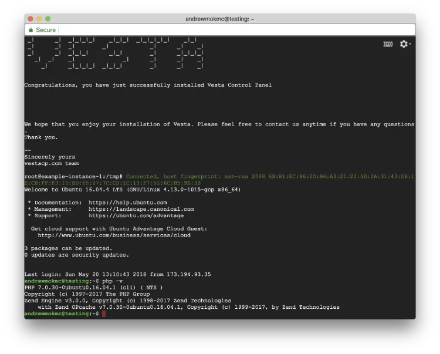
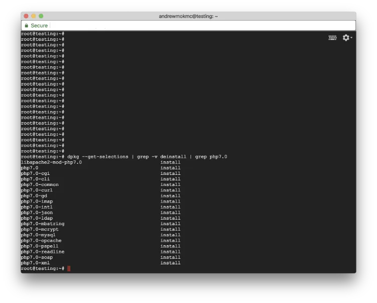
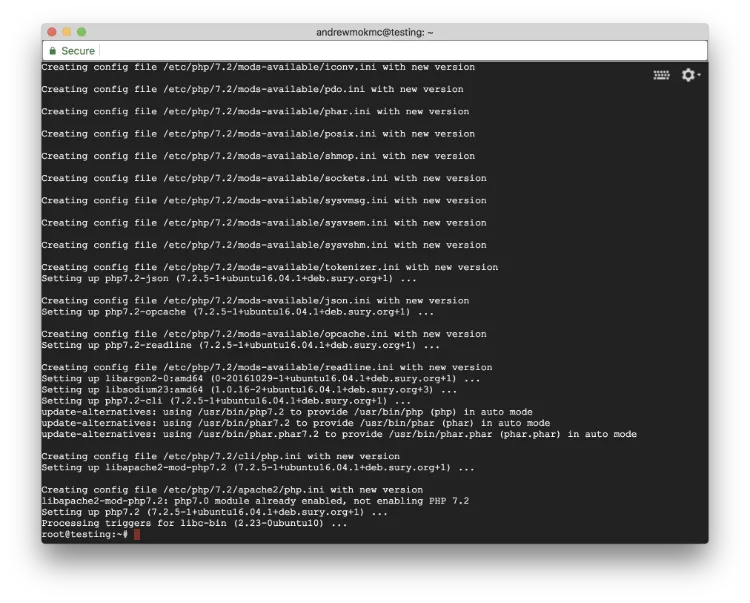
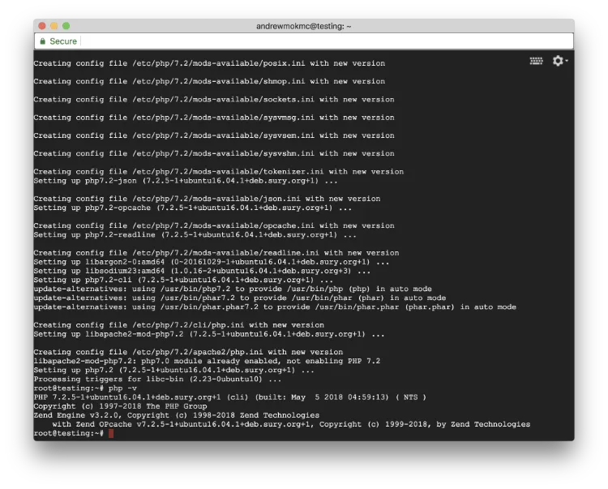
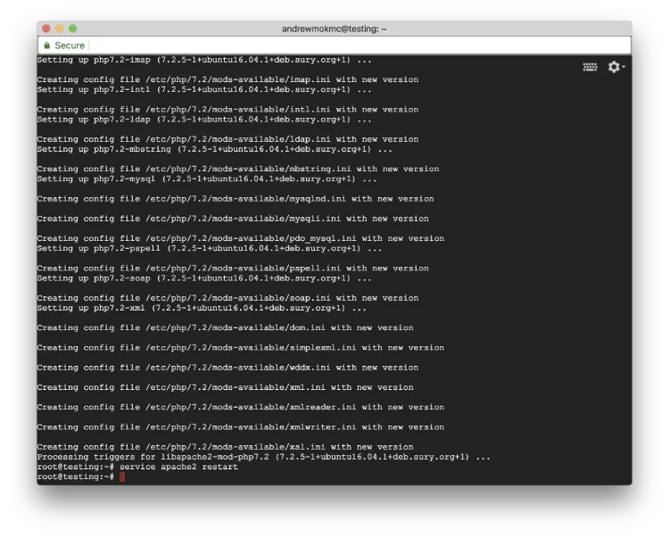

#### 在 GCE 上使用 VestaCP 建置 Ubuntu 16.04 LEMP 伺服器（第 3 部分）

在[上一篇文章](/blog/install-vestacp-with-lemp-on-your-vm-instance/zh-hant/)中，我們介紹了如何在伺服器上安裝 VestaCP 與 LEMP。在這篇文章裡，我們會繼續把已安裝的 PHP 版本從 7.0 升級至 7.2。


### 3. 將 PHP 版本從 7.0 升級到 7.2

**(1) 檢查已安裝的 PHP 版本**

首先，打開終端機，透過 SSH 連線到你的伺服器，並切換到 root 權限。

```
$ ssh <USERNAME>@<SERVER_IP>
$ sudo su -
```



在開始之前，你可以先執行以下指令來查看伺服器目前安裝的 PHP 版本。

```
$ php -v
```

如果你安裝的是 Ubuntu 16.04 LTS，透過 VestaCP 安裝腳本通常會得到 PHP 7.0.30。在這篇教學中，我們會把 PHP 升級到 7.2，以享有更多新功能與錯誤修正。

**(2) 檢查已安裝的 PHP 模組**



要查看 Ubuntu 中已安裝的 PHP 模組，可以執行以下指令（因為 Ubuntu 透過套件管理 PHP 模組）：

```
$ dpkg - get-selections | grep -v deinstall | grep php7.0
```

記得先把已安裝模組清單記下來，因為升級到 PHP 7.2 後你需要重新安裝它們。我們不需要安裝 `mcrypt`，因為它在 PHP 7.2 中已被移除。

在這篇教學中，我們需要重新安裝以下模組：

```
libapache2-mod-php7.2
php7.2-cgi
php7.2-cli
php7.2-common
php7.2-curl
php7.2-gd
php7.2-imap
php7.2-intl
php7.2-json
php7.2-ldap
php7.2-mbstring
php7.2-mysql
php7.2-opcache
php7.2-pspell
php7.2-readline
php7.2-soap
php7.2-xml
```

**(3) 在伺服器上安裝 PHP 7.2**



在升級至 PHP 7.2 之前，你需要先更新套件清單。執行以下指令來更新套件並在伺服器上安裝 PHP 7.2：

```
$ apt-get update
$ apt-get install python-software-properties
$ LC_ALL=C.UTF-8 add-apt-repository ppa:ondrej/php
$ apt-get update
$ apt-get install php7.2
```



安裝完成後，嘗試在終端機執行 `php -v`。你應該會看到 PHP 7.2 已成功安裝在伺服器上。

**(4) 在 Apache 停用舊版本 PHP 並啟用新版本**

不過，我們還需要在 Apache 中停用舊版本，並告訴 Apache 使用 PHP 7.2。請試著執行以下指令：

```
$ a2dismod php7.0
$ a2enmod php7.2
$ service apache2 restart
```

重新啟動 `apache2` 服務後，PHP 7.2 就會正式在你的網站伺服器上運作。不過即使我們已有較新的 PHP 版本，仍然需要把先前的模組重新安裝回來。

**(5) 安裝 PHP 模組**

接下來執行以下指令把那些模組裝回來。你可以依照自己的 PHP 應用需求安裝更多或更少的模組。

```
$ apt-get install libapache2-mod-php7.2 php7.2-cgi php7.2-cli php7.2-common php7.2-curl php7.2-gd php7.2-imap php7.2-intl php7.2-json php7.2-ldap php7.2-mbstring php7.2-mysql php7.2-opcache php7.2-pspell php7.2-readline php7.2-soap php7.2-xml
```



然後，是的，再重新啟動一次 `apache2` 服務。

```
$ service apache2 restart
```

**恭喜！** PHP 7.2 現在已經在你的網站伺服器上運行。[接著可以看看下一篇文章，了解如何為你的網域取得免費 SSL 憑證。](/blog/get-free-ssl-certificates-from-let-s-encrypt-for-your-domains/zh-hant/)
