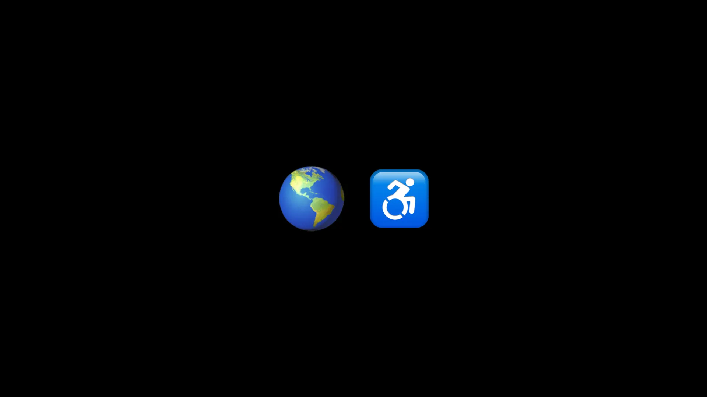
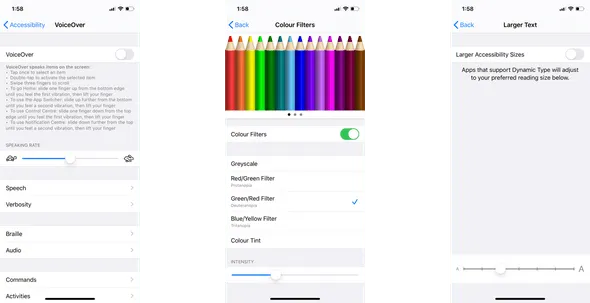
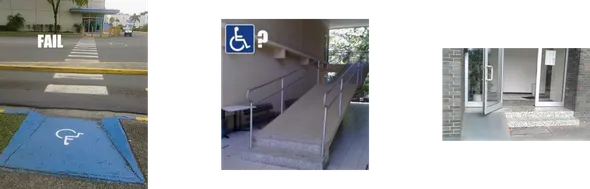
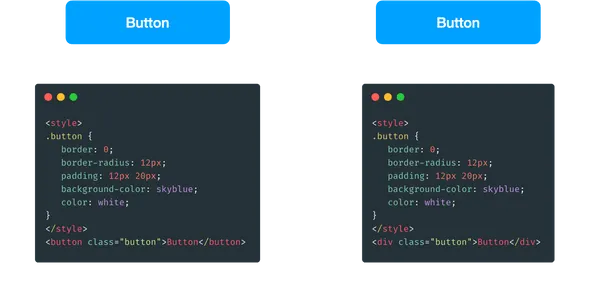
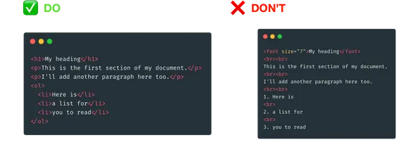
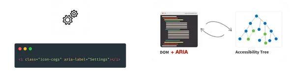
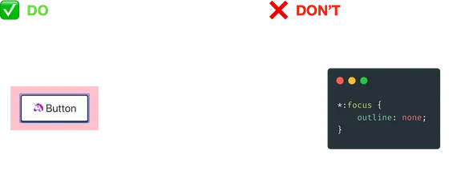
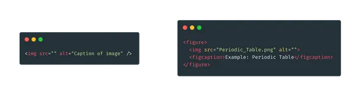
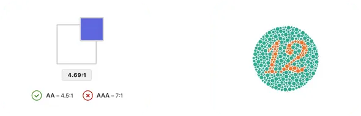

這篇文章整理自我的一次分享。你也可以在[這裡](https://github.com/andrewmmc/share/blob/master/20200521-web-accessibility/index.pdf)查看投影片。

### 什麼是網頁無障礙？

根據 [W3C](https://www.w3.org/standards/webdesign/accessibility) 的定義，網頁無障礙是指為所有人設計與開發的網站或工具，包括身心障礙人士。換句話說，世界上的每一個人都應該能夠在沒有障礙的情況下取得網站內容。

世界上存在不同形式的障礙，例如聽力障礙，代表無法清楚聽見聲音；肢體障礙，代表身體部分功能受限；認知障礙，代表在理解或思考方面存在一定限制；以及視覺障礙，代表視力能力下降。

### 那麼，為什麼網頁無障礙這麼重要？

你可能不知道，根據 [WHO 在 2018 年的數據](https://www.who.int/news-room/fact-sheets/detail/disability-and-health)，其實全球有 15% 人口有某種形式的障礙。也就是說，每 7 個人當中，就有 1 個人有某種障礙。而這些數字還會隨著人口老化與健康問題而持續增加。

我不知道你怎麼看，但對我而言，網路應該是一個為所有人而設計的自由世界，不論你的硬體、軟體或身體能力如何。為身心障礙人士提供平等的使用機會與平等的存取權非常重要。

而且，不要總是假設使用者一定會以我們習慣或預期的方式使用服務或網站。使用者可能會依賴 VoiceOver 來讀取網站內容，也可能在裝置上套用顏色濾鏡。甚至更常見的是，他們會啟用大字體縮放，讓畫面上的文字變得更容易閱讀。



事實上，無障礙失敗在現實世界中往往_更容易被看見_。



不過，在軟體世界裡，這些問題有時不太容易被注意到。正如例子所示，兩個按鈕在使用者瀏覽器中看起來幾乎一樣，但只有左邊那個會被螢幕閱讀器視為真正的按鈕。右邊其實只是一個有樣式但沒有語意的 `div`。這種問題在軟體開發中非常容易被忽略。



### 你可能會說：這只是少數人，為什麼我們要在意？

首先，它幫助的不只是身體有障礙的人，也包括長者與暫時性障礙的人。再者，讓網站完整支援鍵盤操作，對像我們這樣的鍵盤使用者同樣有幫助。它對 SEO 也有很大好處，因為 Google 與其他搜尋引擎能更好地理解網站內容。SEO 技巧與無障礙之間其實有不少重疊，修正網站的無障礙問題，也可能改善 SEO 表現。

### 常見錯誤

當然，我不會把所有 W3C 標準都列在這裡，但我想分享一些常見而且可以避免的問題。

### 語意化 HTML 標籤

請優先使用原生的語意化 HTML 標籤，而不是只把一般 HTML 標籤拿來硬套樣式。語意化標籤能更清楚地向瀏覽器描述內容層級與用途。



以下是一些 HTML5 中常見的語意化標籤：

```
<address>
<article>
<aside>
<blockquote>
<code>
<details>
<figcaption>
<figure>
<footer>
<h1>
<header>
<main>
<mark>
<nav>
<ol>
<p>
<section>
<strong>
<sub>
<summary>
<sup>
<time>
<ul>
```

### WAI-ARIA 標籤

有些情況下，我們未必能單靠語意化標籤處理網站中的所有元素。這時便可以在 DOM 元素上加上 ARIA 標籤，讓螢幕閱讀器更容易理解它們的用途。其中一個常見例子就是只有 icon 的元素。



### Focus 狀態與鍵盤導覽

不要把 `outline` 設為 `none`。我知道藍色的 focus 外框未必很好看，但它在使用鍵盤導覽時提供了非常重要的視覺回饋，讓使用者知道目前焦點在哪裡。如果你真的想移除它，請務必提供其他可辨識的替代樣式。YouTube 的 focus 狀態處理方式就是一個不錯的例子。



### 圖片說明

同樣地，請替圖片加上替代文字或說明，描述圖片所代表的內容。



### 設計

不要以為無障礙只是開發者的工作。其實在設計階段就可以開始處理，例如注意色彩對比、hover 與 focus 狀態，以及色盲模擬。在更長遠的角度來看，這可以在使用者發現問題之前就先把問題消除。



### 套用規則

你也可以考慮加入一些 lint 規則或稽核工具，例如 ESLint 外掛；甚至直接在裝置上開啟 VoiceOver，親自體驗螢幕閱讀器是怎樣看待你的網站。

- eslint-plugin-jsx-a11y
- axe-core
- Google Chrome Lighthouse（Audit）
- Stark（Sketch plugin）
- iPhone 或 Mac 上的 VoiceOver

網頁無障礙並不是不用思考就能簡單修好的一件事，但從一開始就把它納入考量，永遠是值得的。某些國家甚至已經對無障礙設立了法規。更重要的是，改善無障礙不只幫助身心障礙人士，同時也讓每一位使用者受益。

### 延伸閱讀

- [MDN web docs — Accessibility](https://developer.mozilla.org/en-US/docs/Learn/Accessibility)
- [Google Web Fundamentals — Accessibility](https://developers.google.com/web/fundamentals/accessibility)
- [Accessibility in government — GOV.UK blogs](https://accessibility.blog.gov.uk/)
- [The A11Y Project](https://a11yproject.com/)
- [A11ymatters](https://www.a11ymatters.com/)

### 參考資料

- Apple. (2017). What’s New in Accessibility. Retrieved from [https://developer.apple.com/videos/play/wwdc2017/215](https://developer.apple.com/videos/play/wwdc2017/215)
- Arvin H. (2019). Importance of Web Accessibility. Retrieved from [https://blog.techbridge.cc/2019/10/13/web-accessibility-intro](https://blog.techbridge.cc/2019/10/13/web-accessibility-intro)
- Dan Na. (2017). Creating an Accessibility Engineering Practice. Retrieved from [http://a11y.danielna.com](http://a11y.danielna.com/)
- Stereobooster. (2019). The Button. Retrieved from [https://dev.to/stereobooster/the-button-3kme](https://dev.to/stereobooster/the-button-3kme)
- W3C. (2020). Accessibility. Retrieved from [https://www.w3.org/standards/webdesign/accessibility](https://www.w3.org/standards/webdesign/accessibility)
